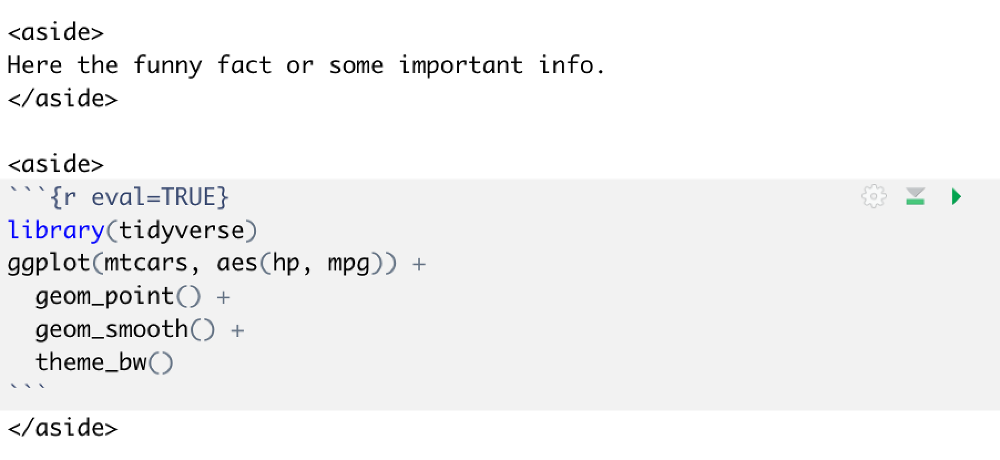

```{r setup, include=FALSE}
knitr::opts_chunk$set(echo = T)
```

# Why should we use *Distill*?

Because it's an easy, quick and free way to go online today. All you need to create a website or a blog is R, RStudio and [*Netlify*](https://www.netlify.com/) account. Moreover, it requires very little programming. It might not look too fancy in the beginning (though totally enough for me), but with some effort you'll be able to re-design your website as you wish. Besides, *Distill* was originally aimed to make scientific online-publishing easier, so, it can't be too bad ;). By the way, The blog you reading right now was created with *Distill*. How? That's what this article is all about.

If you don't have or don't want to have a Github account (and continuous deployment), just read on. But if you are comfortable with Github and wanna continuously deploy via Github, jump to the chapter "Automated continuous publishing (deploying)".

# Manual intermittent publishing (deploying)

Why should we even consider manual instead of automated? Well, for some non-programmers going with the continuous deployment via Github immediately might be very challenging and frustrating. I've been there. We all know what is "better" and "more time effective" in the long run, but the complexity might sometimes turn us off from doing something we would love to, resulting into "it's just not my cup of tea" attitude. Other do not even need the continuous deployment, because they publish rarely, e.g. once per month, but would still like to be online. Going to the WordPress and co., which would most likely screw either code or code-output, is not always a solution. Fortunately, *Distill* and *Netlify* greatly reduce the complexity of going online. Thus, have a look at the quick (<5 minutes) video and then follow the step by step procedure described below and you'll be online with your blog in minutes.

```{r, eval=T, echo=F}
vembedr::embed_youtube("p9nuRKaF4nM")
```


## 1. Install *Distill* package

```{r eval=FALSE}
install.packages("distill")
```

## 2. Create your blog either manually with RStudio or with one line of code

### 2.1. with RStudio

- Open RStudio
- Go to File => New Project... => New Directory => Distill Blog
- "Directory name" will be the name of the folder, where all the documents from your blog will be stored
- Choose the directory where this folder supposed to be stored
- Give your blog a name. You'll be able to rename it later
- Click "Create project"

### 2.2. with one line of code

```{r eval=FALSE}
distill::create_blog(dir = "amazing blog", title = "A cool name of my blog")
# or
distill::create_website(dir = "amazing website", title = "A cool name of my Website")
```


## 3. Build your website

A new RStudio window with newly created files and folders (right bottom corner) will open itself. One of the folders "_posts" will contain all your posts. There are already some examples of it. But don't bother about it now. 

- Find the "Build" tab and press "Build Website". You'll see the process of building.
- Click "Open in Browser" and explore your website

We aren't online yet. But very soon!

## 4. Publish your blog (or a website) via Netlify

- go the [*https://www.netlify.com/*](https://www.netlify.com/), sing up for *Netlify* (I used the Email way) and confirm your Email.
- In Netlify you'll see a window with: 
"Want to deploy a new site without connecting to Git?
Drag and drop your site folder here". If you somehow don't see it, find and press "Team overview".
- go to the directory of your blog and find the "_site" folder
- drag and drop the "_site" folder from your computed into this window
- wait a moment till the "Production" tab produces green colored "Published" and you'll get a funny named website in the left top corner, also green and starting with "https://". My was "https://condescending-darwin-bc567f.netlify.app" :)
- click on it

**Congrats, you are online!**

- go back to *Netlify*, click "Site settings" => "Change site name" 
- rename your site (e.g. better-name) and hit "Save"
- Click on the "better-name.netlify.app" to make sure the name has changed and the site is still working
- go back to RStudio to populate your blog

## 5. Create a new blog-post

- run the line below with the name of your choice

```{r eval=FALSE}
distill::create_post("My second blog post...this one will be really good :-)")
```

- a new partly pre-filled Rmarkdown document will open itself in RStudio
- fill it with some text and code as you usually do with Rmarkdown documents
- hit "Knit". **NOTE:** you'll need to always "Knit" all changed or created blog-posts individually. It is the only way to update them. "Build Website" would not re-render them for you, because it's computationally expensive and prone to problems. However, the *Distill*-Website (we are doing *Distill*-Blog now) would. You can learn more about the difference between them [here](https://rstudio.github.io/distill/website.html).

This new post exists only on your local computer, still not online, thus...

- go back to *Netlify* and click "Deploys" tab, where you'll see another window with: "Need to update your site? Drag and drop your site folder here"
- drag and drop the "_site" folder there and wait till "Production" tab produces green "Published"
- click on the "better-name.netlify.app" to make sure the new blog-post appeared
- click on your post and enjoy your creative work for a moment ;), then 
- go back to RStudio and repeat step 5


# Automated continuous publishing (deploying)

Continuous deployment is cool! But the path there can be a little prickly. This path may take a couple of hours or days (in my case 🙈). But, once there, you quickly forget all the troubles and *using Github with continuous deployment* becomes your second nature. So, I think there are many people which deploy either still manually or already continuously. But not many of them in the middle (I might be wrong though). Thus, I will assume you already have installed *Git* on your computer, created a *Github* account and connected your *RStudio* to your *Github*. If not, but you wanna be there, I could recommend a single short free online book which helped me go through it: [Happy Git and GitHub for the useR](https://happygitwithr.com/). You'll only need it once! If you ready to proceed, have a look at the quick (ca. 8 minutes) video and then follow the step by step procedure described below and you’ll be online with your blog in minutes.

```{r, eval=T, echo=F}
vembedr::embed_youtube("WZt4H-ogH3s")
```


## 1. Install *distill* and *usethis* packages

```{r eval=FALSE}
install.packages("distill")
install.packages("usethis")
```


## 2. Create your blog either manually with RStudio or with one line of code

### 2.1. with RStudio

- Open RStudio
- Go to File => New Project... => New Directory => Distill Blog
- "Directory name" will be the name of the folder, where all the documents from your blog will be stored
- Choose the directory where this folder supposed to be stored
- Give your blog a name. You'll be able to rename it later
- Click "Create project"

### 2.2. with one line of code

```{r eval=FALSE}
distill::create_blog(dir = "amazing blog", title = "A cool name of my blog")
# or
distill::create_website(dir = "amazing website", title = "A cool name of my Website")
```


## 3. Build your website

A new RStudio window with newly created files and folders (right bottom corner) will open itself. One of the folders "_posts" will contain all your posts. There are already some examples of it. But don't bother about it now. 

- Find the "Build" tab and press "Build Website". Your blog will be created in a new window.
- Click "Open in Browser" and explore your website

We aren't online yet. But very soon!

## 4. Connect to your github

### 4.1. Create new repository

- Go back to RStudio and run `use_git()` in order to create a new local Git repository
- then answer two questions:
  - "Is it ok to commit them?" Don't commit by typing 3 for "No", or "Nope" or similar. 
  - "A restart of RStudio is required to activate the Git pane
Restart now?" Restart by typing 2 for "Yes" or "Yup".

```{r eval=FALSE}
usethis::use_git() 
```


After restart you'll see a new "Git" tab appear between the "Build" and "Tutorial" tabs. That's gut! 

- click on the "Git" tab and you'll see empty boxed under "Staged", lot's of yellow question marks under "Status" and the file-names under "Path". 

### 4.2. Stage and Commit

- check all the boxes and press "Commit" button, which is (vertically) between the "Status" and "History" tabs. A colourful window will pop up. This window describes all the changes you are about to make to your blog. 

- Find the "Commit message" box and **definitely** describe what changes you have done (e.g. "First commit"), because then you'll always be able to get back to the previous version, in case something stops working. That's what they call - a version control. 

- press "Commit"

- wait until you see the "Close" button and close "Git commit" 

- forget the other pop up window and go back to RStudio.

### 4.3. Run "usethis::use_github()" to connect a local repository to Github


```{r eval=FALSE}
usethis::use_github() 
```

A new repository will be automatically created on your Github profile and the new browser window with your Github will pop up.

- If you'll be asked: "Which git protocol to use?", choose the one with "https" and if you'll then be asked: "Are title and description ok?", agree to proceed.

**NOTE:** if something (e.g. Github Personal Access Token) doesn't work, get back to the [Happy Git and GitHub for the useR](https://happygitwithr.com/) book and work through it if you still didn't. You'll only need it once! 

## 5. Publish your blog (or a website) via Netlify

- sign into your Netlify account, if have one, if not...

- go the [*https://www.netlify.com/*](https://www.netlify.com/), sing up for *Netlify* either with your Email or with your Github profile.

- click a green box "New site from Git" 

- configure Netlify on "Github", 

- choose a newly created repository, you'll recognize the name ("my new blog"?).

- **NOTE:** Make sure to set the "Publish Directory" to "_site" (could be "docs" if you checked some boxes while creating new project). "_site" (or "docs") contains all the information about your blog.

- click "Deploy"!

- wait a moment till the "Production" tab produces green colored "Published" and you'll get a funny named website in the left top corner, also green and starting with "https://". My was "https://condescending-darwin-bc567f.netlify.app" :)

- click on it

**Congrats, you are online!**

- go back to *Netlify*, click "Site settings" => "Change site name" 
- rename your site (e.g. better-name) and hit "Save"
- click on the "better-name.netlify.app" to make sure the name has changed and the site is still working
- go back to RStudio to populate your blog

## 6. Create a new blog-post

- run the line below with the name of your choice

```{r eval=FALSE}
distill::create_post("My second blog post...this one will be really good :-)")
```

- a new partly pre-filled RMarkdown document will open itself in RStudio 
- fill it with some text and code as you usually do with RMarkdown documents
- hit "Knit". **NOTE:** you'll need to always "Knit" all changed or created blog-posts individually. It is the only way to update them. "Build Website" would not re-render them for you, because it's computationally expensive and prone to problems. However, the *Distill*-Website (we are doing *Distill*-Blog now) would. You can learn more about the difference between them [here](https://rstudio.github.io/distill/website.html).

This new post exists only on your local computer, still not online, thus...

- go to the "Git" tab in RStudio and check all the boxes
- press "Commit", a new window will pop up
- add description of your commit
- again press "Commit"
- wait until you see the "Close" button and close "Git commit" pop up window
- press "Push". Pushing will transfer changes in your blog from your local computer to a remote place, namely your Github repository. And since your Github repository is connected to Netlify, this changes will be online after successful push.
- wait until you see the "Close" button and close "Git push" pop up window
- close or ignore the other pop up window
- get back to your blog "better-name.netlify.app" and refresh (it may take a few seconds, so, don't panic if the first refresh don't work). You should see a new blog-post.

**Congrats! You now continuously deploy your online blog!** 

- click on your post and enjoy your creative work for a moment ;), then 
- go back to RStudio and repeat step 6 with following routine:
  - Create or change posts
  - Knit
  - Commit
  - Push

You don't need to commit and push every change, only important ones. Think of this process as **really** saving the progress you made on your blog. Another useful thing I learned to appreciate after committing a couple of thousands of changes (which is annoying!) is to - check all the boxes (under "stage") at once! For this:

- go to "Terminal" tab in RStuio (it's near the "Console")
- type "git add -A" and press enter
- check one of the stage-boxes, the rest of them suppose to be then check themselves automatically
- then press "Commit"

By the way, if you don't want to publish your post until you really satisfied with it, you can start out as a draft:

```{r eval=FALSE}
distill::create_post("Another nice post", draft = TRUE)
```

Or add **draft: true** to the post’s metadata. When you are ready, delete **draft: true**.


# Blog configuration with "_site.yml"

- Open "_site.yml". You'll see something like that:

```{r eval=FALSE}
name: "Your cool webpage"
title: "Your cool webpage title"
description: |
  Exploring something very important.
base_url: https://beta.rstudioconnect.com/content/your_thing/
navbar:
  logo: images/fancy_logo.png
  right:
    - text: "Home"
      href: index.html
    - text: "About"
      href: about.html
    - text: "Rest"
      href: rest.html
    - icon: fa fa-rss
      href: index.xml
output: distill::distill_article
```

"_site.yml" is the most important document for your website. Configure it carefully and slowly. You can add a lot of useful things: categories, google-analytics, customize the navigation bar, add references, new theme with CSS code for an individual design of your site, icons of twitter & co. and much more, which is not to important for a new site and can be added at any time.

If you work through the [Distill web page](https://rstudio.github.io/distill), you'll see a lot of examples for how to design your "_site.yml" and "theme.css" files. But, the best way I found to do this, is just to find the "_site.yml" or "theme.css" of other Distill-blogs on Github and get inspiration from them by playing with your own code (I hope nobody is offended by this sentence due to the open source nature of R, but please let me know if it's wrong and I'll remove this recommendation!). 

While you already have "_site.yml" file in your blog-folder, you don't have a "theme.css" file. To get one, read on...

# Theming - change desing and appearence of your blog

You can modify the CSS code in your theme after creating it by running the following line of code:

```{r}
distill::create_theme(name = "theme") 
```

To activate a custom theme site-wide, add a theme key to the top-level of your "_site.yml" configuration file:

```{r eval=FALSE}
name: "Your cool webpage"
title: "Your cool webpage title"
theme: theme.css 
(...the rest of your _site.yml)
```


# Pimp your content

Most elements enhancing your content, like links, tables, plots, equations etc., are similar to the usual R Markdown syntax. Thus for a deeper insights go to the [R Markdown: The Definitive Guide](https://bookdown.org/yihui/rmarkdown/) book, it's online and free. Below I just display some quick "how to" examples and provide links to a more thorough online resources. 

## Links

The links are displayed with the help of **two different brackets**. First, use the **square** brackets to produce a [clickable word or phrase], then, directly after the square brackets, use **round** brackets with the URL inside, e.g. (https://bookdown.org/yihui/rmarkdown/). The URL by itself would certainly also work, but it's not as convenient as [this](https://bookdown.org/yihui/rmarkdown/).

## Plots

```{r eval=TRUE, echo=TRUE}
library(tidyverse)
ggplot(mtcars, aes(hp, mpg)) + 
  geom_point() + 
  geom_smooth() +
  theme_bw()
```

## Figures

You can add external static and dynamic figures, plots, photos or diagrams by using `knitr::include_graphics()` function. [More on figures here](https://rstudio.github.io/distill/figures.html).

```{r echo=T, eval=FALSE}
knitr::include_graphics("images/your_figure.png")
```

<!-- It is also possible to numerate plots and figures, by providing the name to the code chunk and naming it by providing a capture to the figure. This will allow you to reference figures using `\@ref(fig:chunk_name_here)`, see Fig. \@ref(fig:chunk_name_here). -->

<!-- ```{r chunk_name_here, fig.cap="Description of my figure or plot here", eval=T, echo=F} -->
<!-- library(ggplot2) -->
<!-- ggplot(mtcars, aes(factor(cyl), hp)) +  -->
<!--   geom_boxplot() + -->
<!--   facet_grid(~ am) + -->
<!--   theme_bw() -->
<!-- ``` -->

## Tables

[More on tables here](https://rstudio.github.io/distill/tables.html).


```{r eval=TRUE, echo=TRUE}
# install.packages("gtsummary")
library(gtsummary)
iris %>% 
  tbl_summary()
```


## Asides

You can include notes or even plots "aside" (to the right) your article:

```{r eval=TRUE, echo=F}

```


<aside>
Here the funny fact or some important info.
</aside>

<aside>
```{r eval=TRUE, echo=F}
# install.packages("tidyverse")
library(tidyverse)
ggplot(mtcars, aes(hp, mpg)) + 
  geom_point() + 
  geom_smooth() +
  theme_bw()
```
</aside>


## Equations

You can use a Latex syntax for it:

```{r echo=T, eval=FALSE}
$$\sigma = \sqrt{ \frac{1}{N} \sum_{i=1}^N (x_i -\mu)^2}$$
```

$$
\sigma = \sqrt{ \frac{1}{N} \sum_{i=1}^N (x_i -\mu)^2}
$$

## Footnotes 

Footnotes are created in the usual RMarkdown way, namely `^[here is the content of your footnote]` and here are two examples ^[Here is the first footnote, which does not suppose to interrupt the main text!] and ^[Here is the second]. Point your cursor on the footnote number or scroll to the bottom of the page to see what's inside of the footnote.


## Thumbnails

Thumbnails (or previews) are the images which are displayed along the post. They serve as an eye catcher. You can add a preview image into the post’s metadata by adding a "preview" field:

```{r eval=FALSE}
title: "Blog post on how to write blog posts"
description: |
  Here we were out of ideas, and therefore we are proud to announce
our new post about how to write a post. Creativity is a b**ch! ... And I love her!
preview: images/photo-of-me-because-I-am-sooo-beautifuuulll-toniiiight.png
```

If you don't provide a picture for preview, the first plot or picture from your blog-post will be used as a thumbnail by default. To override this behavior, you can add the `preview = TRUE` in to the code-chunk, e.g.: `{r some_chunk, preview=TRUE}`.

---------------

If you think, I missed something, please comment on it, and I’ll improve this tutorial.

## Citations

You either can include a BibTex-like citation of others or make your article citable (see the very bottom of this article). "How to cite" is best described in the [citation section of the Distill website](https://rstudio.github.io/distill/citations.html).

# Useful ressources

- The best place to start is actually the Distill website itself: <https://rstudio.github.io/distill>.

- Tom Mocks blog-post on how to build blogs with Distill helped me a lot! https://themockup.blog/posts/2020-08-01-building-a-blog-with-distill/

- One of the best places to learn R is R-Bloggers platform: http://www.R-bloggers.com 