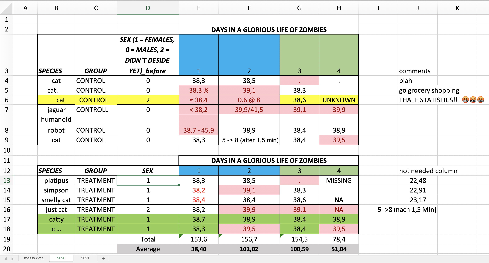

```{r setup, include=FALSE}
knitr::opts_chunk$set(echo = T, warning = F, message = F)
```

## This post as a video

I recommend to watch a video first, because I highlight things I talk about and you have visual examples. It's ca. 12 minutes long.

```{r, eval=T, echo=F}
vembedr::embed_youtube("KW1laBLEiw0")
```

Well, if I had to summarize the whole idea of tidy data into one sentence, I'd say: **"Whatever changes in your data, put it into a column."**

Why columns? Because columns are **the easiest way to store similar data***.* Important is that the data in every column is **similar, but not identical**, so, **the data vary**. For example *age* varies from 1 to 100, *gender* varies from male to female. That's actually why **a column is always a variable**. And a **VARIABLE IS what we need to make any type of analysis possible**. Let me make tidy data even easier for you.

## Principles of tidy data

There are only **3 simple principles for tidy data** (postulated by the father of tidy data Hadley Wickham):

1.  **each column is a variable**,
2.  **each row is an observation**, and
3.  **each cell is a single value** or only one peace of information


For the sake of simplicity, let's say that any dataset which does not follow these three rules is **messy**. And the problem with messy data is that **it requires different strategies** and **tons of work** to extract different variables, in order to enable different statistical analyses.

## Does messy data exist?

These three rules of tidy data seem so obvious that you might wonder whether messy datasets even exist. Well, unfortunately, most real world data is messy, because there are soo many opportunities to mess things up, and people are usually very creative. Leo Tolstoy once said:

**"Happy families are all alike; while every unhappy family is unhappy in its own way"**

**"Like families, tidy datasets are all alike; but every messy dataset is messy in its own way." - Hadley Wickham**

Does this mean, that messy data is bad? Absolutely not. Messy datasets might be very convenient for data collection and for having a good overview of the whole dataset, containing all the information we have, including explanatory columns, commentaries, colors etc. . However, while useful for you, it is useless for **statistics**, which **needs only variables and observations**. So, you might end up having two tables, one for you, and the other one for statistical analysis. Let me show you the most common cases of messy data and how to fix them. The first one is when...

### 1. One variable is stored in multiple columns, or when column headers are actually values, not variable names


Different *timepoints*, for example *years* or *days*, are usually stored in different columns. And while it might be convenient for recording data, it's hardly possible to analyse it. Why? Well, if we have time, we usually want to study change in something over time, right? But a variable **time** does not exist if years are spread across different columns. Moreover, if we see this table for the first time, we have no idea what those **numbers** are, so they are also not a variable, because they are not in a single named column. Making this **wide dataset longer** creates two new variables which immedeatly allows to study the **change in tuberculosis cases over time** for every country.

So, every combination of a country and a year BECOMES **a single observation** of tuberculosis cases, and with that - **a single row**. But if we overdo that, we can end up with a second common problem, where...

### 2. Multiple variables are stored in one column


As mentioned before, the observations within one column suppose to belong together, for example gender with categories "females" and "males", or countries like Brazil and China. However, it's important to separate several **categories** of the same variable, from the column **key**, which stores **two different variables** *cases and population* in one column. *Cases and population* do not belong together, and thus can not be analysed. To solve this problem we simply **make a long table wider**. Now, having two variables we can calculate the rate of tuberculosis by dividing a column cases by the column population. Which would not be possible if both values would be stored in the same cell, being the third common problem...

### 3. More then ONE value in ONE cell


This one can be very sneaky, because it pretends to convey a lot of useful information, like a range of values from zero to five (0-5), undecided values, like 2 or 3 or some borderline values, like \<3 or \>99. To fix this problem, follow the third principle of tidy data and always put only one value in one cell. And, please, **don't use any special characters for numeric values**, because it will produce the next most common problem, where...

### 4. Different types of data (numbers & text) are stored in the same column


**Data can be either numbers or text (categories)**. Any text or special characters (like \@, €, \*, \^, \>, \<, +, (), " ", . etc.) inside of a numeric column converts the whole variable into text. Words like "unknown" or "missing" are the most common examples of text inside of numeric columns. **If the value is missing, it's better to leave the cell empty**. By the way, ironically, missing values can sometimes cause the most damage, so it's really important to ...

### 5. Understand what a missing value really is


The **real missing value** represents a measurement or observation that should have been made, but wasn't. One of the non-intentional mistakes is to put *zeros* (0) into cells with missing values. Think about measuring blood pressure of a cat for example. If cat's owner doesn't bring the cat to the clinic at Monday, the blood pressure record **should remain empty**. However, if we put zero instead of a missing value on Monday, that would mean that blood pressure of our cat WAS measured and it WAS zero - so our Monday cat was either dead or a zombie. An example of a real zero is if you measured virus load of that cat on Tuesday, but did not find any virus. In this case a zero means that our cat is absolutely healthy and it's important to record that 0! So, **a zero conveys a lot of information, while a** **missing value conveys NO information and should therefore remain empty**. But the most complicated form of messy data occurs when (see the picture above)...

### 6. Variables are stored in both rows and columns.


For example, days of the week is our "day" variable which we would like to have in order to study blood pressure of cats over time, so we'd need to put the days into a single column. Then, if we want to estimate an average for Monday we can't do that, because Monday contains two different values, blood pressure and virus load. Thus we need to split the column "test" into two different columns and just move the values. In this tidy data values inside of every columns belong together. Finally, let me quickly show you a few more...

### 7. Examples of messyness and the checklist to follow in order to keep the data tidy



-   remove empty rows

-   remove empty and constant columns

-   remove merged cells

-   use only the first raw as your header

-   store same data in the same table, for instance:

    -   if control and treatment are in two tables, put them below each other and create a new variable - "group", because this is exactly what we want - compare **groups**, then...
    -   if multiple excel sheets contain similar information, for example multiple years, combine them into one table and create a variable - "years", because we often want to study something over time

-   a thing to remember is that statistics has no good taste, thus simple is better then beautiful:

    -   so, any visual effects like colors, italic or bold font etc. don't provide any information, because statistics is blind, thus if colors are important, turn them into variables
    -   if you want to show that some of the observations aren't very good (e.g. calibration error), create a new column "error" and use 1 every time you aren't sure, and 0 every time you are sure about the measurement. That would later allow to exclude these ones easily if we would want to.

-   use short, simple, but still clear column names, instead of long explanational names, because when you start to work with them, it will hurt. Too short names, like "d" or "s" are also bad, because they don't communicate any information, while "days" or "species" do.

-   check for similar but not identical categories (mostly created by typos), because "cat", "cat\_" with a space and "cat." with a dot could be considered three different categories. The solution for that is to go to Excel Table \> Data \> Filter, and to check all categorical variables

-   remove all the columns and data which do not participate in the analyses. As mentioned above, you may keep two tables, one for yourself, with all the explanations and colors, and one new minimalistic table for the analyses

-   but please don't remove rows or columns only because they have some missing values (empty cells), otherwise we would lose a lot of existing information

-   don't summarize, calculate or explain something on the side or below the table, because a software will try to incorporate this information in form of variables or observations

-   if you plan to use R software don't code categorical variables into numbers, for example instead 1 and 2 for sex, write "female" and "male". For SPSS or other software you might need to code them, and last but not least ...

-   if you think your table will become too long or that tidying up the data is too much work ... **stop thinking that** :), because approximately 80% of time in data analysis is spent on cleaning and preparing the data [^1] for calculations

[^1]: Dasu T, Johnson T (2003). Exploratory Data Mining and Data Cleaning. Wiley-IEEE.

## Conclusion

So, these were just the most common messyness examples I encountered. But the human creativity is not be underestimated. Thus, as you can see - it is much easier to learn what to do, namely **only three principles of tidy data**, then what not to do.

## References

<https://vita.had.co.nz/papers/tidy-data.pdf>

Dasu T, Johnson T (2003). Exploratory Data Mining and Data Cleaning. Wiley-IEEE.

------------------------------------------------------------------------

If you think, I missed something, please comment on it, and I'll improve this tutorial.

**Thank you for learning!**
