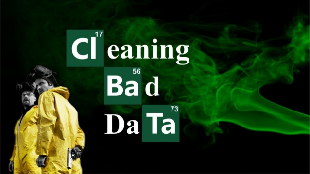

```{r setup, echo = F, include=FALSE, warning=F}
knitr::opts_chunk$set(echo = TRUE)
library(tidyverse)
library(knitr)      # for data wrangling and visualization
```



### Previous topics

You should definitely start with [Data Wrangling Vol. 1](https://yury-zablotski.netlify.com/post/data-wrangling-1/) before continuing here.


### Why do we need it? What are the benefits? 

**80% of work with data is data pre-processing**: cleaning, transforming and wrangling. Using ´The big 6´ English verbs (**arrange, select, mutate, filter, group by and summarise**) would give you a quick and powerful tool for the most of your daily data transformation. But shortly after you get familiar with these 6 verbs, you'll start to ask question like: "What if I need ...(some)... special case?" Such questions are great! The good news is - in most cases the big 6 and their arguments (babies :) will most probably cover that. And there is actually no bad news. Once you work your way through this article, you'll find the answers to the most of your data manipulation questions. The small rest of useful data wrangling techniques will be covered in the [Data Wrangling Vol. 3](https://yury-zablotski.netlify.com/post/2019-09-24-data-wrangling-3/data-wrangling-3/). And please, don't be discouraged by the length of this article, since the most of it is just a printed output for your immediate visual inspection. 

### Coding The big 6 and their babies

Load all needed packages at once to avoid interruptions.

```{r}
library(tidyverse)
library(knitr)   # for the single function "kable" which beautifies tables
```

#### 1. Arrange


Picture originated from [here](https://vk-book.ru/sortirovka-puzyrkom-na-php/)

You can sort value of one or more columns. Compare three tables below: 1. the original table, 2.  table **arranged** with one column and 3.  **arranged** with two columns.

```{r}
table2 %>% 
  kable()

table2 %>% 
  arrange(year) %>% 
  kable()

table2 %>% 
  arrange(year, count) %>% 
  kable()
```

`arrange` orders rows by values in the **ascending** order (low to high) by default. Use `desc` to sort a variable in the **descending** order (high to low). While sorting several variables, only variables where you explicitly mention `desc` will be sorted in a descending order, the others will remain sorted in a default - ascending way.

```{r}
table2 %>% 
  arrange(year, desc(count)) %>% 
  kable()
```

Missing values are always sorted to the end independent of the sorting order, ascending or descending.

```{r}
x <- tibble(y = c(1,2,NA,3,4))   # `tibble` is just a modern table
x %>% arrange(y) 
x %>% arrange(desc(y))
```
 

#### 2. Select


Picture originated from [here](https://pioneerinstitute.org/news/study-finds-ma-inter-district-school-choice-program-a-success-but-should-be-updated/)

Let's have a look at a dataset which have more columns/features: `mtcars`. For more information on the dataset, type `?mtcars` in the console. In the [Data Wrangling 1]( https://yury-zablotski.netlify.com/post/data-wrangling-1/) we have learned the `glimpse` verb, which uncovers the **structure** of the data. But there is another useful command in *R* which can show us the structure of a dataset is `str()`. Let's **rename** a dataset from `mtcars` by assigning it to a new object with `<-` operator and look at the structure of it. This allows you to play with your new dataset `data` without a fear to loos any information simply because you still have the untouched original dataset.

```{r}
data <- mtcars %>% as_tibble()
str(data)
```


`str()` of `data` shows you types of variables, whether they are categorical (factors) or numeric. In [Data Wrangling 1](https://yury-zablotski.netlify.com/post/data-wrangling-1/) we have also learned that we can select columns of our choice by simply writing their names into brackets, e.g.:

```{r}
data %>% 
  select(mpg, hp)
```

If you have a huge table with hundreds of columns, you can select several columns in the middle of it by using a **semicolon** between variables you are interested in:

```{r}
data %>% 
  select(mpg:hp)
```


You can code it even faster, if you exactly known which columns numbers do you need. Thus, we can either select or exclude several columns at once using just numbers. **Note:** compared to many other computer languages, **a first** column in *R* actually means **1, not 0**.

```{r}
data %>% 
  select(2:5, 7) 

data %>% 
  select(-(2:5))
```

If we need several variables which names **start, end or contain something identical**, e.g. "mean_of_this" and "mean_of_that", we can simply ask to select all the variables, which start with some identical part, e.g. "mean_". Don't forget to put the quotations around it, since it supposed to be a character type of variable. 

```{r}
data %>% 
  select(starts_with("c")) 

data %>% 
  select(ends_with("t")) 

data %>% 
  select(contains("a")) 
```

In case when you don't remember how to spell the variable you need, you can give `dplyr` several choices, which might appear and let it choose `one_of` the variables or more, which were spelled correctly. This is useful, if you have to deal with the constant flow of field data and you already know the typical misspellings, you can use `one_of` to cover/catch all the possible cases and **rename** it correctly in the very next step, thus saving your pipeline from breaking down.

```{r}
data %>% 
  select(one_of("mpg", "mpf", "hp", "horsepower", "weight", "wt", "whatever")) 
```

If you need to reorder columns, you can start the order you need by writing wishful names first and then put `everything` else behind it:

```{r}
data %>% 
  select(mpg, hp, everything()) 
```

If you only need a **last column**, just ask for it :). You see, the syntaxes of `dplyr` is sooo natural and intuitive!

```{r}
data %>% 
  select(last_col()) 

data %>% 
  select(last_col(offset = 3)) 
```


Sometimes, we want to select only features **if** they satisfy some condition, e.g. if the are numeric or factors. It is especially useful for huge datasets with hundreds of columns, because you can apply some operations in the next step only on variables you need without picking them "manually" one by one.

```{r}
data %>% 
  select_if(is.numeric)
```

We can also transform particular variable names for our convenience, e.g. we could change the case of the column names to upper (`toupper`) or to lower (`tolower`) cases.

```{r}
data %>% 
  select_at(vars(mpg, hp), toupper)
```

If you need any columns in a vector form, you can `pull` the values our of the data frame:

```{r}
data %>% pull(1)
data %>% pull(4)
```

or ask for a particular (nth`) column:

```{r}
data %>% first()
data %>% nth(9)
data %>% last()
```

#### 3. Mutate


Picture originated from [here](https://www.labtestsonline.org.au/learning/media-library/slide-presentations/cells-genes-signalling-part-1/what-happens-when-a-genetic-mutation-occurs)

**Mutate** literally means - **creating new feature / column**. We can either fill our new feature with whatever we want (play God :) or use the existing (parent) features to calculate a new (offspring) ones. Moreover, right after you have created a new column, you can use it for further calculation in the same chunk of code.

```{r}
data %>% 
  mutate(make_new_column  = "and fill it somehow") %>% 
  mutate(mpg_hp           = mpg / hp) %>% 
  mutate(use_new_column   = mpg_hp * 100) %>% 
  select(make_new_column, mpg_hp, use_new_column, everything())
```

And of coarse you can simply *add a new column*:

```{r}
data %>% 
  select(1:3) %>% 
  add_column(new = 1:32)
```


If you only want to keep only the new variables, use `transmute()`:

```{r}
data %>% 
  transmute(mpg_hp = mpg / hp)
```

You can also create you own table with a `tibble` command, and then grow it by adding new columns using any kind of calculations, where `tibble` is just a modern data frame, or a modern table.

```{r}
d <- tibble(
  a = 1:5,
  b = 6:10)
d
d %>% 
  mutate(add            = a + b,
         substract      = a - b,
         divide         = a / b,
         exponentiate_a = a^2,
         logarithm_of_b = log(b),
         lag_a          = lag(a),
         lead_a         = lead(a))
```

As you can see from the code above, you can use a comma between the new things instead of writing *mutate* every time you creating a new columns. While creating new variables, you can also use aggregated operations, e.g. subtract an average of one column from every value of the same or other column:

```{r}
d %>% 
  mutate(substr  = b - mean(a),
         divide  = b * sum(a),
         diff    = divide - lag(divide),
         cumsum  = cumsum(a),
         cumprod = cumprod(a), 
         cummin  = cummin(a), 
         cummax  = cummax(a),
         logical = a > 3)   # other logical operators: <, <=, >, >=, !=, and ==
```


Last but not least, you can **rank** your values:

```{r}
d %>% 
  mutate(
    ranking = rank(b),
    rows    = row_number(),
    percent_rank(b), 
    cume_dist(b) )
```

You can also transfer the row names to a real column, or vice versa, any columns to row-names:

```{r}
mtcars %>% 
  rownames_to_column() %>% 
  head()   # "head" shows only first 6 rows of a dataset, "tail" the last 6 row
  
d %>% 
  column_to_rownames("b") 
```

Conditional creation or transformation of several columns at the same time is also possible with `mutate_at, mutate_if, mutate_all`:

```{r}
data %>%
  mutate_at(vars(cyl, am, gear), as_factor)

data %>%
  mutate_at(vars(cyl, am, gear), as_factor) %>% 
  mutate_if(is.numeric, log)

data %>%
  mutate_all(log)

data %>%
  mutate_all(funs(mean(.), sum(.)))
```

Scroll to the right to see the whole table.

#### 4. Filter


Until now we worked only with columns / features. Let's learn how to effectively filter out rows / observations. Using simple logical operators, e.g. operators: `<, <=, >, >=, !=` (not equal), `==` (equal), `&` (and), `|` (or), we can tell *R* exactly what do we need to filter out. Doing so, we can use more then one operator at the same time if we need to.


The picture is borrowed from the Book: [R for Data Science](https://r4ds.had.co.nz/) by Garrett Grolemund and Hadley Wickham.

```{r}
data %>% 
  filter(cyl == 6, vs == 0)

data %>% 
  filter(cyl == 6 & vs == 0 & gear == 4)

data %>% 
  filter(cyl == 4 & gear != 4)

data %>% 
  filter(mpg < 30, hp > 200, am == 0)

data %>% 
  filter(cyl == 8 | am == 0)

data %>% 
  filter(mpg > 30 | hp < 90)
```

You could select several categories (values) `%in%` the same column:

```{r}
data %>% 
  filter(cyl %in% c(4,6) & gear %in% c(3,5))
```

You can `slice` through the dataset and choose particular individuals you want by using numbers, or you can ask *dplyr* to get a random sample or fraction of values:

```{r}
data %>% 
  slice(1:5)

data %>% 
  sample_n(5)

data %>% 
  sample_frac(0.1) # since we have 32 rows, 10% of it would be 3 
```

You can select the top number of any variable using `top_n` command:

```{r}
d %>% top_n(3, b)
```


Here is some complex filtering, e.g. you can `rank` any variable and then filter out rows with 5 highest or 5 lowest values of that variable:

```{r}
data %>% 
  filter(rank(mpg) < 5)

data %>% 
  filter(rank(desc(mpg)) < 5)
```

You can figure out how many `distinct` values does a particular column have:

```{r}
data %>% 
  distinct(cyl) 
```

Or how many `unique` values or rows does a dataset have:

```{r}
tibble(y = c(2,2,NA,3,4,4),
       y2 = c(2,2,2,NA,4,4)) %>% 
  unique()
```

Finally, similarly to `add_column` command, you can `add_row`s to your dataset:

```{r}
d %>% 
  add_row(a = 100, b = 101)

d %>% 
  add_row(a = c(333, "bla"), b = c(444, "blup"))

```


#### 5. Group by


Picture originated from [here](http://fumccollingswood.org/connect/adult-groups/life-groups/)

`top_n` we just learned in the previous section is particularly useful for grouping variables, since it gives you top values for every group. For instance, let's pick the two most effective cars (highest `mpg`) for every cylinder group (`cyl`):

```{r}
data %>% 
  group_by(cyl) %>% 
  top_n(2, mpg) %>% 
  arrange(cyl)
```


As mentioned in [Data Wrangling 1](https://yury-zablotski.netlify.com/post/data-wrangling-1/), `group_by` is the most effective if used with `summarise`, thus, we'll start to use both already here.

```{r}
data %>% 
  group_by(cyl, am) %>% 
  summarise(avg = mean(mpg))
```

Similar, to **select** and **mutate** you can **group** variables conditionally using `group_by_if, group_by_all`. For instance, let's change three variables to factors (categories) and group by only categorical (factor) variables. **dplyr** will find all the factor by itself, which is particularly useful for big datasets. Then we'll compute the averages for every group.

```{r}
data %>% 
  mutate_at(vars(cyl, gear, am), factor) %>% 
  group_by_if(is.factor) %>% 
  summarise(avg = mean(mpg))
```

`group_by_all` is useful for finding duplicates. **Count** after grouping and then either **arrange** these counts from high to low with `desc` to bring the duplicates to the top of the resulting table or simply **filter** out all *n* > 1.

```{r}
tibble(y = c(2,2,NA,3,4,4),
       y2 = c(2,2,2,NA,4,4)) %>% 
  group_by_all() %>% 
  count() %>% 
  arrange(desc(n))
```

Groups are great for summarising, but sometimes they might hinder calculations. Thus, you can always `ungroup` any dataset if needed.

Grouped filters are the most useful here:

```{r}
data %>% 
  group_by(cyl) %>% 
  filter(rank(desc(hp)) < 3)
```


#### 6. Summarise


Picture originated from [here](https://ieltsonlinetests.com/reading-tips/how-do-summary-completion-type-questions-ielts-reading)


**Summarise** allows you to calculate **multiple statistics** on **multiple variables**. Below are just a few examples, for more fun like this go to [fancy descriptive statistics](https://yury-zablotski.netlify.com/post/fancy-descriptive-statistics/).

```{r}
data %>% 
  group_by(cyl, am) %>% 
  summarise(count     = n(), 
            distinct  = n_distinct(mpg), 
            aver_mpg  = mean(mpg), 
            st_dev_hp = sd(hp), 
            Q_0.25    = quantile(hp, 0.25), 
            n_of_strong_cars = sum(hp > 150))
```

"NAs" - missing values are “contagious”: almost any operation involving an unknown value will also be unknown. Thus, tell *R* to remove "NAs" with `na.rm` argument.

```{r}
x <- tibble(
  y  = c(2,2,NA,3,4,4),
  y2 = c(2,2,2,NA,4,4)) 

x %>% summarise(mean(y), mean(y2))
x %>% summarise(mean(y, na.rm = TRUE), mean(y2, na.rm = TRUE))
```

Conditional **summirising** of several columns at the same time is also possible with `summarise_at, summarise_if` and `summarise_all`:

```{r}
data %>% 
  group_by(cyl) %>% 
  summarise_at(vars(mpg, hp, wt), mean)

data %>% 
  group_by(cyl, am) %>% 
  summarise_if(is.numeric, mean, na.rm = TRUE)

data %>% 
  group_by(cyl, am) %>% 
  summarise_all(list(avg = mean, med = median)) %>% kable()
```

Scroll to the right to see the whole table.

### Conclusion

There is no perfect data set in the world. Real world data is always messy. That is why you often spend 80% of your time pre-processing raw data. Therefore, you will definitely need the skills you have learned in this post! Thus, it is worth to master this vocabulary, alone for the sake of your nervous system ;) And soon, you'll be able to quickly prepare your raw data to whatever you wish to do next: visualisation, statistical analysis or machine learning algorithm, and spend more time being creative.

### What’s next

- [Data Wrangling Vol. 3: tidy data](https://yury-zablotski.netlify.com/post/2019-09-24-data-wrangling-3/data-wrangling-3/)
- [Fancy tables: frequency, contingency and pivot](https://yury-zablotski.netlify.com/post/fancy-tables/)
- [Fancy descriptive statistics](https://yury-zablotski.netlify.com/post/fancy-descriptive-statistics/)

**Thank you for reading!**

### Further readings and references

- Amazing and Free Book by Garrett Grolemund and Hadley Wickham: [“R for Data Science”](https://r4ds.had.co.nz/)
- for more info on `dplyr` package and to download a *Cheat sheet* (it's really good) go [here](https://dplyr.tidyverse.org/)


