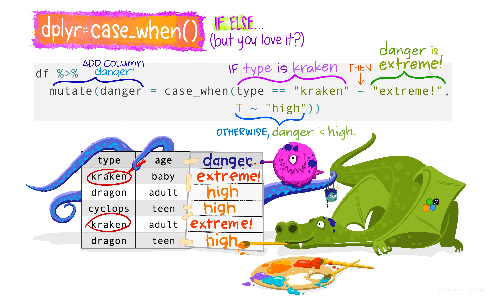

```{r setup, include=FALSE}
knitr::opts_chunk$set(echo = T)
library(magick)
library(tidyverse) # it's the only package you need
```

# Previous topics

To maximize the effect of this post you can have a look at [{dplyr} for beginners](https://yuzar-blog.netlify.app/posts/2023-01-31-datawrangling1/), [advanced {dplyr}](https://yuzar-blog.netlify.app/posts/2023-02-07-datawrangling2/) and the review about [{tidyr} package](https://yuzar-blog.netlify.app/posts/2023-04-18-datawrangling3/) before.


Consider following tables:

```{r}
library(tidyverse) # it's the only package you need
x <- tibble(A = c("1", "1", "2"), B = c("a", "b", "a"))
y <- tibble(A = c("1", "2"), B = c("a", "b"))
z <- tibble(A = c("3", "2", "1"), C = c("a", "b", "c"), D = c("here", "you", "go"))
```


```{r message=FALSE, warning=FALSE, echo=F}
library(gridExtra)
gridExtra::grid.arrange(tableGrob(x), tableGrob(y), tableGrob(z), ncol = 3)
```

# Chapter 1: Combine tables

## Chapter 1 as 4 minutes video


```{r, eval=T, echo=F}
vembedr::embed_youtube("aL7PeNOvAfw") 
```

## Bind columns and bind rows

To combine several tables into one, we can combine their columns or rows. The **bind_cols** function is the most intuitive way to combine columns.

```{r}
bind_cols(x, z) 
```

**bind_cols** even renames identical column names, making sure each column is unique. But here's the catch: the tables can have a different number of columns, but they must have the same number of rows. Otherwise it refuses to work and throws a following error message:

```{r eval=FALSE}
bind_cols(x, y)
```

    Error in `bind_cols()`:
    ! Can't recycle `..1` (size 3) to match `..2` (size 2).

Looking to stack two tables vertically? Look no further than **bind_rows**! Just remember, these tables should have the same column names. Otherwise, **bind_rows** will generously populate your new dataset with NAs wherever the column names don't align. 


```{r}
bind_rows(x, z)
```

And that can be a problem. Because when dealing with multiple large tables, it's easy to lose track of which data belongs to which table. But no worries! The '.id' argument comes to the rescue. It allows you to easily track and identify which table certain values belong to.

```{r}
bind_rows(y, z,  .id = "table") 
```


## Union, setdiff and intersect

However, even though **bind_rows** always delivers, when dealing with sizable tables containing numerous columns, we may end up with an excess of irrelevant columns without even realizing it. That's why I personally lean towards using the **union_all** command. It accomplishes the same task as **bind_rows**, but if my data isn't clean, it throws an informative error message, which often saves me from chaos.

```{r echo=FALSE}
image_animate(image_read("union-all.gif"))
```

```{r eval = F}
union_all(y, z)
```

    Error in `union_all()`:
    ! `x` and `y` are not compatible.
    ✖ Different number of columns: 2 vs 3.


```{r}
bind_rows(x, y)
union_all(x, y)
```

But while combining tables via **bind_rows** or **union_all** is useful, it might produce duplicates 👯‍♀, if identical rows appear in both tables. We usually don't want that! In order to exclude duplicates and keep only one of identical rows while combining tables, we can use **union** command instead of **union_all**.

```{r echo=FALSE}
image_animate(image_read("union.gif"))
#image_read("union-rev.gif")
```


```{r}
union(x, y)
```


While the union command excludes duplicates, there are situations where we need to identify the distinct rows in table "x" that do not exist in table "y", or vice versa. This is where the **setdiff** command comes into play. By specifying two tables, we can easily find all the unique rows that belong to the first specified table. 


```{r echo=FALSE}
image_animate(image_read("setdiff.gif"))
```

```{r}
# find rows that appear in x but not y
setdiff(x,y)
```

To obtain unique rows from the "y" table, simply specify "y" as the first table, followed by the "x" table.

```{r echo=FALSE}
image_animate(image_read("setdiff-rev.gif"))
```

```{r}
# find rows that appear in y but not x
setdiff(y,x)     
```


But while **setdiff** completely excludes duplicate rows from a dataset, there are times when we actually want to focus on those duplicates to better understand the repetitive patterns in our data. In order to isolate only the duplicate rows, we can use the **intersect** command.

```{r echo=FALSE}
image_animate(image_read("intersect.gif"))
```


```{r}
intersect(x,y)   # find duplicates
```


# Chapter 2: Join tables

Combining and merging tables through joins is incredibly useful for data science, as it enables us to unlock valuable insights within complex datasets. While joining tables is usually performed using SQL, this approach comes with numerous limitations. In this chapter, we'll explore how the intuitive syntax of {dplyr} can revolutionize our ability to join tables, taking our skills to a whole new level of efficiency and flexibility.

## Chapter 2 as 10 minutes video


```{r, eval=T, echo=F}
vembedr::embed_youtube("_w6yLNbxabU") 
```


Being able to handle duplicate rows, as we did in previous chapter, is fantastic! But you might wonder, what if we have duplicate columns? That can occur when we use the **bind_cols** command. For instance, if we mistakenly combine two identical tables, each with 2 columns, the result will have 4 columns. The **bind_cols** command conveniently renames them to avoid confusion, yet it retains all columns. However, as they do not provide any unique information, they are totally redundant!

```{r}
bind_cols(x, x)
```

Thus, we would love *R* to recognize duplicate columns, to eliminate redundancy by retaining only one column, but also to merge columns that differ in order to make our final model more informative. For example, we might want to combine data about customer purchases with data about customer demographics in order to understand what factors influence customer behavior. And this is precisely the purpose of join commands - to **allow you to combine data from multiple tables**. There are two types of joins: **mutating and filtering**. Let's begin with the four **mutating** joins.


## Mutating joins 

### 1. inner_join

The `inner_join` is the most intuitive. It finds identical columns, keeps just one of them, adds all not matching columns behind it and ignores the rest.

```{r echo=FALSE}
image_animate(image_read("inner-join.gif"))
```

One useful example of applying **inner_join** is when you have two datasets, let's say a "Customers" dataset and an "Orders" dataset. Both datasets have a common column, such as "Customer ID," which serves as a unique identifier for each customer. Such unique identifier is often called **key column**.

By performing an inner_join on the "Customer ID" column, you can merge the two datasets based on matching customer IDs. This operation allows you to create a consolidated dataset that contains information from both datasets but only for customers who have placed orders. In other words, it filters out any customers who have not made any purchases.

```{r}
# Load the dplyr package
library(dplyr)

# Create the Customer Information table
customer_info <- data.frame(
  CustomerID = c("001", "002", "003"),
  Name = c("John", "Sarah", "Michael"),
  Age = c(25, 30, 28),
  Email = c("john@example.com", "sarah@example.com", "michael@example.com")
)

# Create the Purchase History table
purchase_history <- data.frame(
  CustomerID = c("001", "002", "004"),
  PurchaseDate = as.Date(c("2022-07-15", "2022-06-10", "2022-08-20")),
  Product = c("Laptop", "Phone", "Headphones")
)

# Perform the inner join
inner_join(customer_info, purchase_history, by = "CustomerID")
```

This merged dataset can be valuable for analyzing customer behavior, understanding purchasing patterns, or conducting targeted marketing campaigns to specific customer segments.

**But we have to be very careful here**!!! (Arni) The **inner_join** only keeps observations from one table that have perfectly matching values in the other table. If we take our x and y tables, we'll see that only the first row "1 a" is kept, while "1 b" and "2 a" from table x have no match in table y, and the "2 b" from table y has no match in table x. 

```{r}
# install.packages("gridExtra")
library(gridExtra)
grid.arrange(
  tableGrob(x),
  tableGrob(y),
  tableGrob(inner_join(x, y)),
  ncol = 3)
```

And that's the most important property of an **inner_join** - **unmatched rows in either table are not included in the result**. This means that generally inner joins are not appropriate in most analyses, because it is **too easy to lose observations**.

If you want to keep all the observations from "x", or from "y", or from both tables, we need to apply `outer_joins`. And there are three of them:


- `left_join`  keeps all observations from the left table
- `right_join` keeps all observations from the right table
- `full_join`  keeps all observations from both tables


### 2. left_join

```{r echo=FALSE}
image_animate(image_read("left-join.gif"))
#image_animate(image_read("left-join-extra.gif"))
```

While the **inner_join** may be the most intuitive, it is the **left_join** that proves to be most commonly employed join in practice and, actually, the most useful for several reasons:

- first, if one table is more important then other, **left joins** allow us to **preserve all the observations from the left table**, even if there are no matches in the right table. This ensures that no important data is lost during merging;

- secondly, the **new data** from the right table that corresponds to the matching observations in the left table **is added**

- and finally, **left joins** highlight any discrepancies or mismatches between the tables being joined. When a left join introduces empty values (such as NA) for unmatched observations, it serves as an indicator of data inconsistencies or missing values. Detecting these mismatches early on is crucial for ensuring data integrity and avoiding erroneous conclusions.

Let's consider the same example where you have two tables: one containing customer information and another containing purchase history. Here, we want to merge the two tables using a left join to **retain all customer information while incorporating relevant purchase data**. Particularly, customers 001 and 002 had matching records in both tables, so their purchase information was included in to final table. Customer 003, who had no corresponding record in the purchase history table, resulted in NULL values for the purchase-related columns.

```{r}
# Perform the left join
left_join(customer_info, purchase_history, by = "CustomerID")
```

The "by = " argument in the "left_join" command is crucial!, because it specifies columns that serve as the matching criterion between the two tables being joined. It determines how the rows from each table will be matched and merged.

If the "by = " argument is not provided, the **left_join** command finds identical columns in both tables and uses them all by default. However, that could result in incorrect matches or cause errors during the merging process if columns having the same information named differently. Therefore, it is crucial to specify the correct column(s) to ensure accurate and meaningful results in the merged table.


```{r}
# Create the first table
t1 <- data.frame(
  ID = c(1, 2, 3),
  Name = c("John", "Sarah", "Michael")
)

# Create the second table
t2 <- data.frame(
  Identifier = c(1, 2, 3),
  Value = c(10, 20, 30)
)
```

For example, let's **left_join** t1 and t2 based on the common ID/Identifier column.

In the first case, when the "by" argument is not specified, the left_join command attempts to automatically match the columns. However, since the columns have different names (ID vs. Identifier), the join does not work, because our tables have no common variables. 

```{r eval=FALSE}
# Perform the left join without specifying the "by" argument
left_join(t1, t2)
```

    Error in `left_join()`:
    ! `by` must be supplied when `x` and `y` have no common
      variables.


But if the correct "by" argument is used, specifying that the ID column from t1 corresponds to the Identifier column from t2, **left_join** works properly.

```{r}
left_join(t1, t2, by = c("ID" = "Identifier"))
```


```{r eval=FALSE, include=FALSE}
# install.packages("gridExtra")
gridExtra::grid.arrange(
  tableGrob(x),
  tableGrob(y),
  tableGrob(inner_join(x, y)),
  tableGrob(full_join(x, y)),
  tableGrob(left_join(x, y)),
  tableGrob(right_join(x, y)),
  ncol = 2)
```


### 3. right_join

```{r echo=FALSE}
image_animate(image_read("right-join.gif"))
```


**Right_join** works similarly to **left_join** by retaining all observations from the right table, "purchase_history" in our case. In fact, in many cases, a **right_join** can be replaced by a **left_join** by reversing the table order. In this way you can achieve the same outcome and retain the same information. So, to be honest, we can ignore **right_join**, but we can't ignore the **full_join**, and here is why.

```{r}
right_join(customer_info, purchase_history)
left_join(purchase_history, customer_info)
```


### 4. full_join

```{r echo=FALSE}
image_animate(image_read("full-join.gif"))
```

**Full_joins** are extremely useful due to their ability to retain all records from both tables, even if there are mismatches or missing values. In this way **full_joins** ensure that no data is lost during the merging process, which is crucial for thorough data analysis and decision-making. Besides, **full_joins** help to identify and investigate inconsistencies and gaps between the datasets, leading to better data quality and more complete data for analysis.


```{r}
full_join(customer_info, purchase_history)
```


Compared to **inner_join** that retains only two matching rows, and compared to **left_join** and **right_join** that retain only three rows, the **full_join** combines all four records from both tables, incorporating *NA* values in the absence of matches. When not all columns act as "keys", a **full join seamlessly combines the functionalities of both left and right joins**, offering a comprehensive merging approach.

However, not everything is rosy here! While returning every mismatch can help identify inconsistencies between tables and potentially fill gaps using [advanced machine learning techniques](https://youtu.be/Akb401i32Oc), it can also pose a significant challenge. The sheer volume of "new" observations generated can quickly become overwhelming. In large and complex datasets, which are often the norm, and when both tables contain NAs from the beginning, distinguishing between original NAs and the "new" NAs becomes nearly impossible. This creates a dangerous situation where you might unknowingly proceed with analysis and produce unrealistic results.

**Therefore, despite the benefits of joins, be very careful and always double check the output.**


## Filtering joins combine rows


Filtering joins affect only the rows (or observations), not the columns (or variables). In contrast to mutating joins, filtering joins never duplicate rows. There are two filtering joins, semi_joins and anti_joins.

### 1. semi_join

```{r echo=FALSE}
image_animate(image_read("semi-join.gif"))
```

**Semi_joins** help identify and keep matching records between two tables while retaining only the columns from the first (left) table.

{width=49%} {width=49%}

The **inner_join** might look similar, but it would keep columns from both tables. By keeping only the desired columns from the left table, **semi_joins** help to reduce data complexity and focus on the essential information needed for analysis. In other words they filter and extract relevant records, resulting in a more concise and targeted dataset. 


```{r}
semi_join(customer_info, purchase_history)
inner_join(customer_info, purchase_history)
```

### 2. anti_join

```{r echo=FALSE}
image_animate(image_read("anti-join.gif"))
```

**Anti_joins** are used to exclude records that match between two tables, essentially filtering out the common observations.

{width=49%} {width=49%}

An **anti_join** retains only unmatched rows, making it useful for identifying discrepancies between tables, and if the anti-join returns no results, it's actually a good thing ;).


```{r}
anti_join(customer_info, purchase_history)
```


Now that you have your final table in the desired structure, you probably want to explore and visualize your data, aren't you? If you're looking for a comprehensive video that will teach you how to efficiently explore all the aspects of the data you see on your screen below right now, then you definitely don't want to miss out on [this one](https://youtu.be/Swcp0_l65lw).


# Chapter 3: Conditioning

## Chapter 3 as 2 minutes video


```{r, eval=T, echo=F}
vembedr::embed_youtube("Qxs2EB9072g") 
```


Having columns and rows in the desired structure is fantastic, and if your table is prepared to embark on the "machine learning wonderland," it's even better. However, sometimes we need to change some values within our tables. Here, I would like to introduce two highly valuable techniques that I use everyday.

## If ... else ...

The first technique is the **ifelse** command, which enables the creation of a new column based on an existing one (as shown in the first line of code below), or the modification of values within an existing variable (as demonstrated in the second line). When working with NAs in your data, it's crucial to specify the "na.rm = TRUE" argument to prevent all new observations from becoming NAs (as illustrated in the third line of code).

```{r}
full_join(customer_info, purchase_history) %>%
  select(CustomerID, Age) %>% 
  mutate(Age_category = ifelse(Age < mean(Age, na.rm = T), "low", "high")) %>% 
  mutate(Age = ifelse(Age < median(Age, na.rm = T), "low", "high")) %>% 
  mutate(Age_NAs = ifelse(Age < mean(Age), "low", "high"))
```

The only drawback of using **ifelse** is that it becomes cumbersome to write multiple **ifelse** statements when dealing with numerous cases, which is where the **case_when** function comes in handy.

## Case when



Let's consider the "who" dataset 🦉, which is freely available from the World Health Organization Global Tuberculosis (cough 😷) Report. Initially, it may appear messy, but if you're familiar with my previous tutorials on {dplyr} and {tidyr}, you can easily tidy it up and then transform the age categories from the peculiar "014" format to more comprehensible "0 – 14 years old". By using the `TRUE ~ "bla"` clause at the end of the **case_when** command, any categories that do not match the provided ones will be changed to "bla". If there are occurrences of "bla", it indicates that further cleaning is required. However, if no "bla" cases are present, as in our example, it signifies that we have successfully accomplished our task. Let's congratulate ourselves on a job well done! Cheers!


```{r}
d <- who %>%
  
  # I have reviewed {dplyr} and {tidyr} for this piece of code.
  pivot_longer(cols = new_sp_m014:newrel_f65, values_drop_na = T) %>%
  select(-iso2, -iso3) %>%
  mutate(name = stringr::str_replace(name, "newrel", "new_rel")) %>%
  separate(name, into = c("new", "type", "sexage")) %>%
  separate("sexage", into = c("sex", "age"), sep = 1) %>%
  
  # Now use case_when to change values
  mutate(age_2 = case_when(
    age == "014"  ~ "0 – 14 years old",
    age == "1524" ~ "15 - 24 years old",
    age == "2534" ~ "25 - 34 years old",
    age == "3544" ~ "35 - 44 years old",
    age == "4554" ~ "45 - 54 years old",
    age == "5564" ~ "55 - 64 years old",
    age == "65"   ~ "65 or older",
    TRUE          ~ "bla"
  ))

d

# janitor is an amazing package I also have reviewed ;)
janitor::tabyl(d$age_2)
```


# Conclusion and what's next?

Now, with your final, stunning table in front of you, the natural inclination is to visualize and explore your data, right? To achieve this in the most effective way possible, check out the [{DataExplorer} package](https://youtu.be/W3xErD6qIzg) next.

**Thank you for reading!**

# Further readings and references

- Most of this article originate from [“R for Data Science”](https://r4ds.hadley.nz/) book by Garrett Grolemund and Hadley Wickham.

