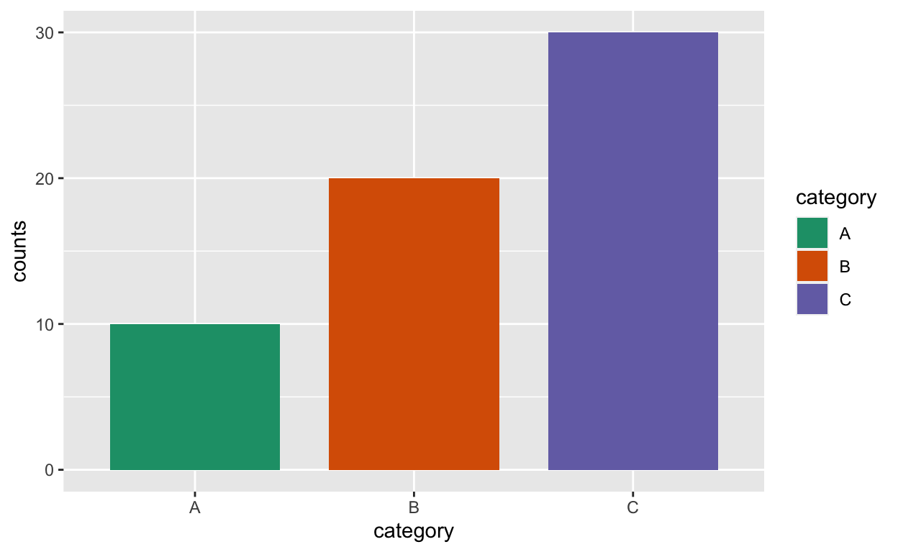
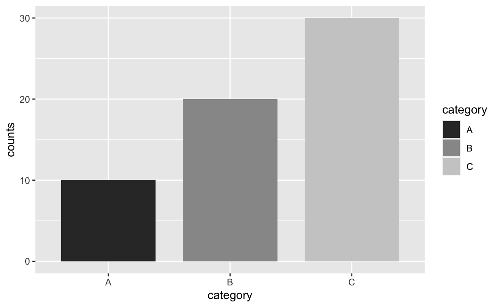
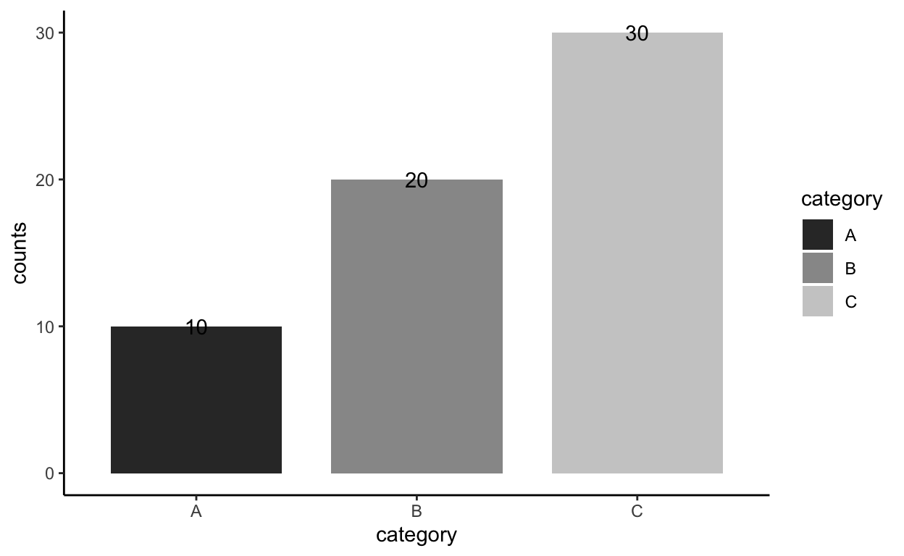
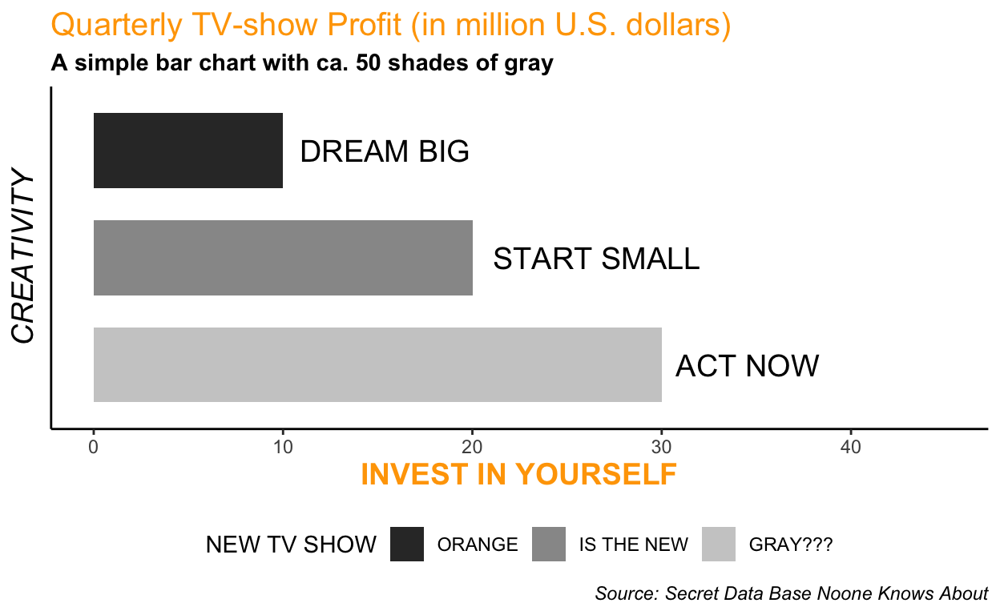
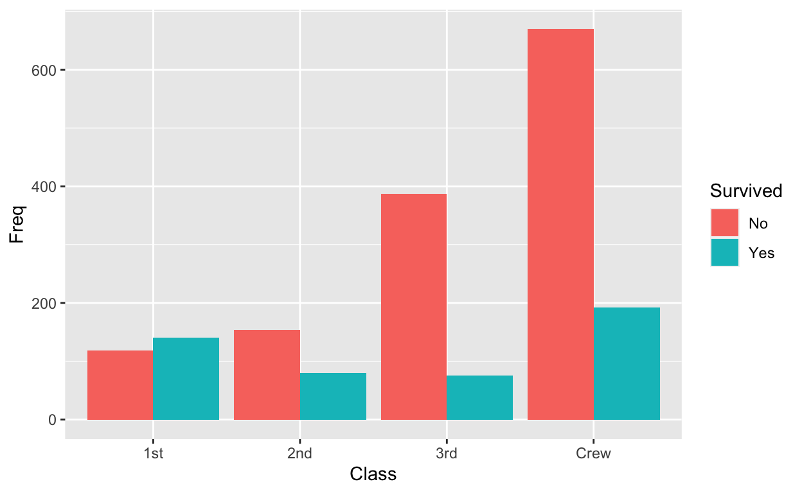
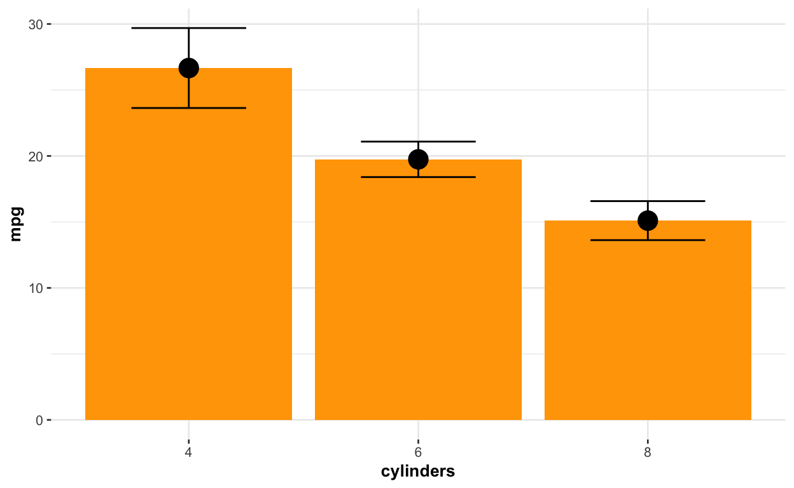
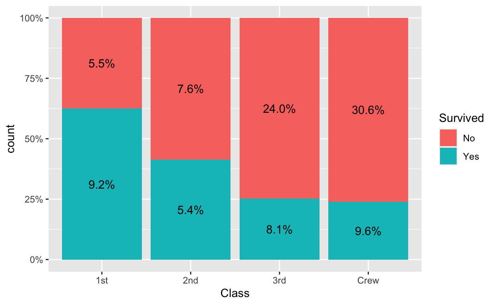
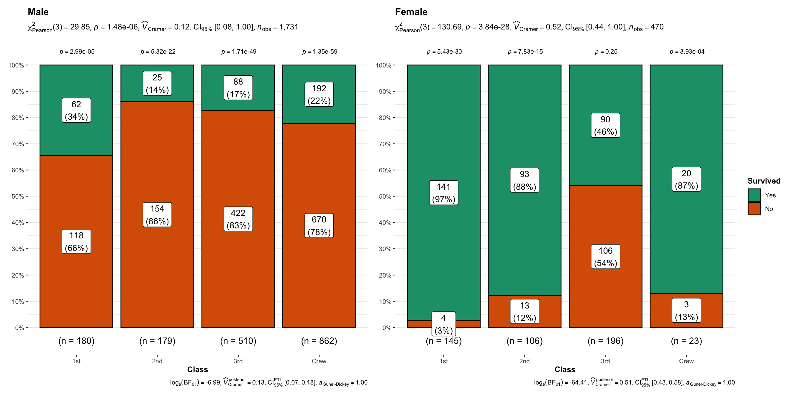

# This post as ... minutes video


<div class="layout-chunk" data-layout="l-body">

```{=html}
<div class="vembedr">
<div>
<iframe src="https://www.youtube.com/embed/" width="533" height="300" frameborder="0" allowfullscreen="" data-external="1"></iframe>
</div>
</div>
```

</div>


# Basic barplots 1: count

To start, we need to load the {tidyverse} meta-package since it includes {ggplot2} and other valuable packages. We'll also need some data, such as the Wage dataset from the {ISLR} package. Typical raw data often involves cases that haven't been counted yet. Fortunately, manual counting isn't necessary, as counting is inherently integrated into the default functionality of the geom_bar function. To create our first bar chart using the ggplot() function, we'll only need to specify three elements: the (1) data frame, (2) aesthetics including the categorical variable education on the x-axis, and (3) the geom_bar function with the *stat = "count"* argument. Explicitly specifying *stat = "count"* is unnecessary though since it's the default behavior. In these illustrations, the bar height signifies the case count for each education level.

<div class="layout-chunk" data-layout="l-body">
<div class="sourceCode"><pre class="sourceCode r"><code class="sourceCode r"><span><span class='kw'><a href='https://rdrr.io/r/base/library.html'>library</a></span><span class='op'>(</span><span class='va'><a href='https://tidyverse.tidyverse.org'>tidyverse</a></span><span class='op'>)</span></span>
<span></span>
<span><span class='va'>Wage</span> <span class='op'>&lt;-</span> <span class='fu'>ISLR</span><span class='fu'>::</span><span class='va'><a href='https://rdrr.io/pkg/ISLR/man/Wage.html'>Wage</a></span></span>
<span><span class='fu'><a href='https://pillar.r-lib.org/reference/glimpse.html'>glimpse</a></span><span class='op'>(</span><span class='va'>Wage</span><span class='op'>)</span></span></code></pre></div>

```
Rows: 3,000
Columns: 11
$ year       <int> 2006, 2004, 2003, 2003, 2005, 2008, 2009, 2008, 2…
$ age        <int> 18, 24, 45, 43, 50, 54, 44, 30, 41, 52, 45, 34, 3…
$ maritl     <fct> 1. Never Married, 1. Never Married, 2. Married, 2…
$ race       <fct> 1. White, 1. White, 1. White, 3. Asian, 1. White,…
$ education  <fct> 1. < HS Grad, 4. College Grad, 3. Some College, 4…
$ region     <fct> 2. Middle Atlantic, 2. Middle Atlantic, 2. Middle…
$ jobclass   <fct> 1. Industrial, 2. Information, 1. Industrial, 2. …
$ health     <fct> 1. <=Good, 2. >=Very Good, 1. <=Good, 2. >=Very G…
$ health_ins <fct> 2. No, 2. No, 1. Yes, 1. Yes, 1. Yes, 1. Yes, 1. …
$ logwage    <dbl> 4.318063, 4.255273, 4.875061, 5.041393, 4.318063,…
$ wage       <dbl> 75.04315, 70.47602, 130.98218, 154.68529, 75.0431…
```

<div class="sourceCode"><pre class="sourceCode r"><code class="sourceCode r"><span><span class='fu'><a href='https://ggplot2.tidyverse.org/reference/ggplot.html'>ggplot</a></span><span class='op'>(</span>data <span class='op'>=</span> <span class='va'>Wage</span>, <span class='fu'><a href='https://ggplot2.tidyverse.org/reference/aes.html'>aes</a></span><span class='op'>(</span>x <span class='op'>=</span> <span class='va'>education</span><span class='op'>)</span><span class='op'>)</span> <span class='op'>+</span></span>
<span>  <span class='fu'><a href='https://ggplot2.tidyverse.org/reference/geom_bar.html'>geom_bar</a></span><span class='op'>(</span>stat <span class='op'>=</span> <span class='st'>"count"</span><span class='op'>)</span></span></code></pre></div>
<div class="sourceCode"><pre class="sourceCode r"><code class="sourceCode r"><span><span class='fu'><a href='https://ggplot2.tidyverse.org/reference/ggplot.html'>ggplot</a></span><span class='op'>(</span><span class='va'>Wage</span>, <span class='fu'><a href='https://ggplot2.tidyverse.org/reference/aes.html'>aes</a></span><span class='op'>(</span><span class='va'>education</span><span class='op'>)</span><span class='op'>)</span> <span class='op'>+</span></span>
<span>  <span class='fu'><a href='https://ggplot2.tidyverse.org/reference/geom_bar.html'>geom_bar</a></span><span class='op'>(</span><span class='op'>)</span></span></code></pre></div>


</div>


# Basic barplots 2: (bourne) identity

However, when dealing with preprocessed and summarized data where counts are already categorized, we can utilize *stat = "identity"* within the *geom_bar* function. To demonstrate this, let's create the simplest possible data frame containing only three categories and three corresponding counts.

<div class="layout-chunk" data-layout="l-body">
<div class="sourceCode"><pre class="sourceCode r"><code class="sourceCode r"><span><span class='va'>df</span> <span class='op'>&lt;-</span> <span class='fu'><a href='https://tibble.tidyverse.org/reference/tibble.html'>tibble</a></span><span class='op'>(</span></span>
<span>  category <span class='op'>=</span> <span class='fu'><a href='https://rdrr.io/r/base/c.html'>c</a></span><span class='op'>(</span><span class='st'>"A"</span>, <span class='st'>"B"</span>, <span class='st'>"C"</span><span class='op'>)</span>,</span>
<span>  counts <span class='op'>=</span> <span class='fu'><a href='https://rdrr.io/r/base/c.html'>c</a></span><span class='op'>(</span><span class='fl'>10</span>, <span class='fl'>20</span>, <span class='fl'>30</span><span class='op'>)</span></span>
<span><span class='op'>)</span></span>
<span><span class='va'>df</span></span></code></pre></div>

```
# A tibble: 3 × 2
  category counts
  <chr>     <dbl>
1 A            10
2 B            20
3 C            30
```

</div>


The aesthetics will now encompass not only the x-axis with a categorical variable but also the y-axis with readily available counts. The *stat="identity"* (think of the Bourne Identity movie) argument helps to **identify** which counts correspond to which categories. With this straightforward example in hand, let's discover how we can significantly enhance the visual appeal of our plot.

<div class="layout-chunk" data-layout="l-body">
<div class="sourceCode"><pre class="sourceCode r"><code class="sourceCode r"><span><span class='fu'><a href='https://ggplot2.tidyverse.org/reference/ggplot.html'>ggplot</a></span><span class='op'>(</span>data<span class='op'>=</span><span class='va'>df</span>, <span class='fu'><a href='https://ggplot2.tidyverse.org/reference/aes.html'>aes</a></span><span class='op'>(</span>x<span class='op'>=</span><span class='va'>category</span>, y<span class='op'>=</span><span class='va'>counts</span><span class='op'>)</span><span class='op'>)</span> <span class='op'>+</span></span>
<span>  <span class='fu'><a href='https://ggplot2.tidyverse.org/reference/geom_bar.html'>geom_bar</a></span><span class='op'>(</span>stat<span class='op'>=</span><span class='st'>"identity"</span><span class='op'>)</span></span></code></pre></div>


</div>


First of all, we can effortlessly adjust the width of our grey bars by employing the width argument, setting it, for instance, to 0.4:

<div class="layout-chunk" data-layout="l-body">
<div class="sourceCode"><pre class="sourceCode r"><code class="sourceCode r"><span><span class='fu'><a href='https://ggplot2.tidyverse.org/reference/ggplot.html'>ggplot</a></span><span class='op'>(</span>data<span class='op'>=</span><span class='va'>df</span>, <span class='fu'><a href='https://ggplot2.tidyverse.org/reference/aes.html'>aes</a></span><span class='op'>(</span>x<span class='op'>=</span><span class='va'>category</span>, y<span class='op'>=</span><span class='va'>counts</span><span class='op'>)</span><span class='op'>)</span> <span class='op'>+</span></span>
<span>  <span class='fu'><a href='https://ggplot2.tidyverse.org/reference/geom_bar.html'>geom_bar</a></span><span class='op'>(</span>stat<span class='op'>=</span><span class='st'>"identity"</span>, width<span class='op'>=</span><span class='fl'>0.4</span><span class='op'>)</span></span></code></pre></div>


</div>


But gray bars appear rather dull. Thus, to reduce the monotony, we can inject some colors into the chart. For example, by using the *fill* argument inside of *geom_bar*, we can paint the bars white, while utilizing the *color* argument to give the edges a chocolate shade. It's like a tiramisu – with a chocolate coating on the outside and a creamy white filling on the inside.

<div class="layout-chunk" data-layout="l-body">
<div class="sourceCode"><pre class="sourceCode r"><code class="sourceCode r"><span><span class='fu'><a href='https://ggplot2.tidyverse.org/reference/ggplot.html'>ggplot</a></span><span class='op'>(</span>data<span class='op'>=</span><span class='va'>df</span>, <span class='fu'><a href='https://ggplot2.tidyverse.org/reference/aes.html'>aes</a></span><span class='op'>(</span>x<span class='op'>=</span><span class='va'>category</span>, y<span class='op'>=</span><span class='va'>counts</span><span class='op'>)</span><span class='op'>)</span> <span class='op'>+</span></span>
<span>  <span class='fu'><a href='https://ggplot2.tidyverse.org/reference/geom_bar.html'>geom_bar</a></span><span class='op'>(</span>stat<span class='op'>=</span><span class='st'>"identity"</span>, width<span class='op'>=</span><span class='fl'>0.4</span>, </span>
<span>           fill<span class='op'>=</span><span class='st'>"white"</span>, color <span class='op'>=</span> <span class='st'>"chocolate4"</span><span class='op'>)</span></span></code></pre></div>


</div>


But if, for whatever reason, we want different colors for different bars, we can put the *fill* and *color* arguments inside of *aesthetics* to make it aesthetically more appealing:

<div class="layout-chunk" data-layout="l-body">
<div class="sourceCode"><pre class="sourceCode r"><code class="sourceCode r"><span><span class='fu'><a href='https://ggplot2.tidyverse.org/reference/ggplot.html'>ggplot</a></span><span class='op'>(</span>data<span class='op'>=</span><span class='va'>df</span>, <span class='fu'><a href='https://ggplot2.tidyverse.org/reference/aes.html'>aes</a></span><span class='op'>(</span>x<span class='op'>=</span><span class='va'>category</span>, y<span class='op'>=</span><span class='va'>counts</span>, </span>
<span>                    fill <span class='op'>=</span> <span class='va'>category</span>, color <span class='op'>=</span> <span class='op'>-</span><span class='va'>counts</span><span class='op'>)</span><span class='op'>)</span> <span class='op'>+</span></span>
<span>  <span class='fu'><a href='https://ggplot2.tidyverse.org/reference/geom_bar.html'>geom_bar</a></span><span class='op'>(</span>stat<span class='op'>=</span><span class='st'>"identity"</span><span class='op'>)</span></span></code></pre></div>


</div>


By the way, we can save our plot as an object, which not only reduces the need for excessive typing but also enables us to employ this object for subsequent manipulations:

<div class="layout-chunk" data-layout="l-body">
<div class="sourceCode"><pre class="sourceCode r"><code class="sourceCode r"><span><span class='va'>p</span> <span class='op'>&lt;-</span> <span class='fu'><a href='https://ggplot2.tidyverse.org/reference/ggplot.html'>ggplot</a></span><span class='op'>(</span>data<span class='op'>=</span><span class='va'>df</span>, <span class='fu'><a href='https://ggplot2.tidyverse.org/reference/aes.html'>aes</a></span><span class='op'>(</span>x<span class='op'>=</span><span class='va'>category</span>, y<span class='op'>=</span><span class='va'>counts</span>, fill <span class='op'>=</span> <span class='va'>category</span><span class='op'>)</span><span class='op'>)</span> <span class='op'>+</span></span>
<span>  <span class='fu'><a href='https://ggplot2.tidyverse.org/reference/geom_bar.html'>geom_bar</a></span><span class='op'>(</span>stat<span class='op'>=</span><span class='st'>"identity"</span>, width<span class='op'>=</span><span class='fl'>0.777</span><span class='op'>)</span></span>
<span><span class='va'>p</span></span></code></pre></div>


</div>


For example, we can manually fill the bars with a color of our choice, or apply custom color palettes to our object, but, to be honest, I never use them:

<div class="layout-chunk" data-layout="l-body">
<div class="sourceCode"><pre class="sourceCode r"><code class="sourceCode r"><span><span class='va'>p</span> <span class='op'>+</span> <span class='fu'><a href='https://ggplot2.tidyverse.org/reference/scale_manual.html'>scale_fill_manual</a></span><span class='op'>(</span>values<span class='op'>=</span><span class='fu'><a href='https://rdrr.io/r/base/c.html'>c</a></span><span class='op'>(</span><span class='st'>"#999999"</span>, <span class='st'>"orange"</span>, <span class='st'>"violet"</span><span class='op'>)</span><span class='op'>)</span></span></code></pre></div>
<div class="sourceCode"><pre class="sourceCode r"><code class="sourceCode r"><span><span class='va'>p</span> <span class='op'>+</span> <span class='fu'><a href='https://ggplot2.tidyverse.org/reference/scale_brewer.html'>scale_fill_brewer</a></span><span class='op'>(</span>palette<span class='op'>=</span><span class='st'>"Dark2"</span><span class='op'>)</span> </span></code></pre></div>


</div>


Instead, I absolutely love and use the minimalistic grey scaled bars in varying appealing shades of gray (50 shades of gray pic ;)

<div class="layout-chunk" data-layout="l-body">
<div class="sourceCode"><pre class="sourceCode r"><code class="sourceCode r"><span><span class='va'>p</span> <span class='op'>&lt;-</span> <span class='va'>p</span> <span class='op'>+</span> <span class='fu'><a href='https://ggplot2.tidyverse.org/reference/scale_grey.html'>scale_fill_grey</a></span><span class='op'>(</span><span class='op'>)</span> </span>
<span><span class='va'>p</span></span></code></pre></div>


</div>


However, what is totally not appealing is this bland, gray background. Fortunately, there's a straightforward solution for it – the use of *themes*! *Themes* allow us to change the plot's design with a single command. Here are examples of minimalistic or classic themes. However, by typing "theme_" and pressing the "tab" button, you'll be presented with multiple themes, enabling you to quickly find your personal favorite.


<div class="layout-chunk" data-layout="l-body">
<div class="sourceCode"><pre class="sourceCode r"><code class="sourceCode r"><span><span class='va'>p</span> <span class='op'>+</span> <span class='fu'><a href='https://ggplot2.tidyverse.org/reference/ggtheme.html'>theme_minimal</a></span><span class='op'>(</span><span class='op'>)</span></span></code></pre></div>
<div class="sourceCode"><pre class="sourceCode r"><code class="sourceCode r"><span><span class='va'>p</span> <span class='op'>&lt;-</span> <span class='va'>p</span> <span class='op'>+</span> <span class='fu'><a href='https://ggplot2.tidyverse.org/reference/ggtheme.html'>theme_classic</a></span><span class='op'>(</span><span class='op'>)</span></span>
<span><span class='va'>p</span></span></code></pre></div>


</div>


Cool, isn't it? But do you know what's even cooler? The fact that we can easily add labels to our bars. Everyone appreciates labels, right? :) We achieve this using the "geom_text" function and telling our plot-aesthetics from which column we want to extract our labels:

<div class="layout-chunk" data-layout="l-body">
<div class="sourceCode"><pre class="sourceCode r"><code class="sourceCode r"><span><span class='va'>p</span> <span class='op'>+</span> <span class='fu'><a href='https://ggplot2.tidyverse.org/reference/geom_text.html'>geom_text</a></span><span class='op'>(</span><span class='fu'><a href='https://ggplot2.tidyverse.org/reference/aes.html'>aes</a></span><span class='op'>(</span>label<span class='op'>=</span><span class='va'>counts</span><span class='op'>)</span><span class='op'>)</span></span></code></pre></div>


</div>


While labels are indeed useful, the placement of our text is rather peculiar – neither on the bar, nor under the bar. Additionally, they are somewhat small and challenging to discern due to their black color. Therefore, it's necessary to enlarge their size, vertically adjust them and make their color more visible.

<div class="layout-chunk" data-layout="l-body">
<div class="sourceCode"><pre class="sourceCode r"><code class="sourceCode r"><span><span class='va'>p</span> <span class='op'>+</span> <span class='fu'><a href='https://ggplot2.tidyverse.org/reference/geom_text.html'>geom_text</a></span><span class='op'>(</span><span class='fu'><a href='https://ggplot2.tidyverse.org/reference/aes.html'>aes</a></span><span class='op'>(</span>label<span class='op'>=</span><span class='va'>counts</span><span class='op'>)</span>, </span>
<span>              size<span class='op'>=</span><span class='fl'>10</span>, vjust<span class='op'>=</span><span class='fl'>2</span>, color<span class='op'>=</span><span class='st'>"orange"</span><span class='op'>)</span></span></code></pre></div>


</div>


But wait, there's more – we can actually determine the labels themselves by simply writing them down! And you won't believe this – we can those labels bold! (foto лысого жирного чувака, уже есть :)


<div class="layout-chunk" data-layout="l-body">
<div class="sourceCode"><pre class="sourceCode r"><code class="sourceCode r"><span><span class='va'>p</span> <span class='op'>+</span> </span>
<span>  <span class='fu'><a href='https://ggplot2.tidyverse.org/reference/geom_text.html'>geom_text</a></span><span class='op'>(</span></span>
<span>    <span class='fu'><a href='https://ggplot2.tidyverse.org/reference/aes.html'>aes</a></span><span class='op'>(</span>label<span class='op'>=</span><span class='fu'><a href='https://rdrr.io/r/base/c.html'>c</a></span><span class='op'>(</span><span class='st'>"BLACK"</span>, <span class='st'>"IS THE NEW"</span>, <span class='st'>"ORANGE"</span><span class='op'>)</span><span class='op'>)</span>, </span>
<span>    size<span class='op'>=</span><span class='fl'>7</span>, vjust<span class='op'>=</span><span class='fl'>2</span>, color<span class='op'>=</span><span class='st'>"orange"</span>, fontface <span class='op'>=</span> <span class='st'>"bold"</span><span class='op'>)</span></span></code></pre></div>


</div>


And when vertical positioning just won't fit all that amazing text, we can use a few tricks to bring our plot to another level:

- first, we can effortlessly flip the entire plot using the *coord_flip* function;
- then, we'll horizontal adjust our text, ensuring it fits right near the bars;
- we'll then extend the x-axis to 45 to make sure every bit of text is displayed;
- and finally, we can even change the order of our discrete categories for a smoother, more reader-friendly flow with a *scale_x_discrete* function

<div class="layout-chunk" data-layout="l-body">
<div class="sourceCode"><pre class="sourceCode r"><code class="sourceCode r"><span><span class='va'>p</span> <span class='op'>&lt;-</span> <span class='va'>p</span> <span class='op'>+</span> </span>
<span>  <span class='fu'><a href='https://ggplot2.tidyverse.org/reference/geom_text.html'>geom_text</a></span><span class='op'>(</span></span>
<span>    <span class='fu'><a href='https://ggplot2.tidyverse.org/reference/aes.html'>aes</a></span><span class='op'>(</span>label<span class='op'>=</span><span class='fu'><a href='https://rdrr.io/r/base/c.html'>c</a></span><span class='op'>(</span><span class='st'>"BLACK"</span>, <span class='st'>"IS THE NEW"</span>, <span class='st'>"ORANGE"</span><span class='op'>)</span><span class='op'>)</span>, </span>
<span>    size<span class='op'>=</span><span class='fl'>7</span>, hjust<span class='op'>=</span><span class='op'>-</span><span class='fl'>0.1</span>, color<span class='op'>=</span><span class='st'>"orange"</span>, fontface <span class='op'>=</span> <span class='st'>"bold"</span><span class='op'>)</span><span class='op'>+</span></span>
<span>  <span class='fu'><a href='https://ggplot2.tidyverse.org/reference/coord_flip.html'>coord_flip</a></span><span class='op'>(</span><span class='op'>)</span><span class='op'>+</span></span>
<span>  <span class='fu'><a href='https://ggplot2.tidyverse.org/reference/lims.html'>ylim</a></span><span class='op'>(</span><span class='fl'>0</span>, <span class='fl'>45</span><span class='op'>)</span><span class='op'>+</span></span>
<span>  <span class='fu'><a href='https://ggplot2.tidyverse.org/reference/scale_discrete.html'>scale_x_discrete</a></span><span class='op'>(</span>limits<span class='op'>=</span><span class='fu'><a href='https://rdrr.io/r/base/c.html'>c</a></span><span class='op'>(</span><span class='st'>"A"</span>, <span class='st'>"B"</span>, <span class='st'>"C"</span><span class='op'>)</span><span class='op'>)</span></span>
<span><span class='va'>p</span></span></code></pre></div>


</div>


Now that our main plot is in good shape, let's consider the legend. Well, handling the legend can be pain in the ass. But, no worries, you're in control here. With the *theme* function and the *legend.position* argument, you can adjust the legend's placement – *top, bottom, or no legend* at all. Plus, if you need to, you can change the legend's *name* and *labels* too to whatever you want.

<div class="layout-chunk" data-layout="l-body">
<div class="sourceCode"><pre class="sourceCode r"><code class="sourceCode r"><span><span class='va'>a</span> <span class='op'>&lt;-</span> <span class='va'>p</span> <span class='op'>+</span> <span class='fu'><a href='https://ggplot2.tidyverse.org/reference/theme.html'>theme</a></span><span class='op'>(</span>legend.position<span class='op'>=</span><span class='st'>"top"</span><span class='op'>)</span></span>
<span><span class='va'>b</span> <span class='op'>&lt;-</span> <span class='va'>p</span> <span class='op'>+</span> <span class='fu'><a href='https://ggplot2.tidyverse.org/reference/theme.html'>theme</a></span><span class='op'>(</span>legend.position<span class='op'>=</span><span class='st'>"bottom"</span><span class='op'>)</span></span>
<span><span class='va'>c</span> <span class='op'>&lt;-</span> <span class='va'>p</span> <span class='op'>+</span> <span class='fu'><a href='https://ggplot2.tidyverse.org/reference/theme.html'>theme</a></span><span class='op'>(</span>legend.position<span class='op'>=</span><span class='st'>"none"</span><span class='op'>)</span></span>
<span> </span>
<span><span class='va'>p</span> <span class='op'>&lt;-</span> <span class='va'>p</span> <span class='op'>+</span> <span class='fu'><a href='https://ggplot2.tidyverse.org/reference/theme.html'>theme</a></span><span class='op'>(</span>legend.position<span class='op'>=</span><span class='st'>"bottom"</span><span class='op'>)</span><span class='op'>+</span> </span>
<span>  <span class='fu'><a href='https://ggplot2.tidyverse.org/reference/scale_grey.html'>scale_fill_grey</a></span><span class='op'>(</span>name <span class='op'>=</span> <span class='st'>"Quarter"</span>, </span>
<span>                  labels <span class='op'>=</span> <span class='fu'><a href='https://rdrr.io/r/base/c.html'>c</a></span><span class='op'>(</span><span class='st'>"1"</span>, <span class='st'>"2"</span>, <span class='st'>"3"</span><span class='op'>)</span><span class='op'>)</span></span>
<span></span>
<span><span class='kw'><a href='https://rdrr.io/r/base/library.html'>library</a></span><span class='op'>(</span><span class='va'><a href='https://patchwork.data-imaginist.com'>patchwork</a></span><span class='op'>)</span></span>
<span><span class='op'>(</span><span class='va'>a</span> <span class='op'>+</span> <span class='va'>b</span><span class='op'>)</span> <span class='op'>/</span> <span class='op'>(</span><span class='va'>c</span> <span class='op'>+</span> <span class='va'>p</span><span class='op'>)</span></span></code></pre></div>


</div>


<div class="layout-chunk" data-layout="l-body">
<div class="sourceCode"><pre class="sourceCode r"><code class="sourceCode r"><span><span class='fu'><a href='https://ggplot2.tidyverse.org/reference/theme.html'>theme</a></span><span class='op'>(</span></span>
<span></span>
<span>    <span class='co'># Legend title and text labels</span></span>
<span>    <span class='co'>#:::::::::::::::::::::::::::::::::::::::::::::::::::::::::::</span></span>
<span>    </span>
<span>    <span class='co'># Title font color size and face</span></span>
<span>    legend.title <span class='op'>=</span> <span class='fu'><a href='https://ggplot2.tidyverse.org/reference/element.html'>element_text</a></span><span class='op'>(</span><span class='va'>color</span>, <span class='va'>size</span>, <span class='va'>face</span><span class='op'>)</span>,</span>
<span>    <span class='co'># Title alignment. Number from 0 (left) to 1 (right)</span></span>
<span>    legend.title.align <span class='op'>=</span> <span class='cn'>NULL</span>,             </span>
<span>    <span class='co'># Text label font color size and face</span></span>
<span>    legend.text <span class='op'>=</span> <span class='fu'><a href='https://ggplot2.tidyverse.org/reference/element.html'>element_text</a></span><span class='op'>(</span><span class='va'>color</span>, <span class='va'>size</span>, <span class='va'>face</span><span class='op'>)</span>, </span>
<span>    <span class='co'># Text label alignment. Number from 0 (left) to 1 (right)</span></span>
<span>    legend.text.align <span class='op'>=</span> <span class='cn'>NULL</span>,</span>
<span>    </span>
<span>    <span class='co'># Legend position, margin and background</span></span>
<span>    <span class='co'>#:::::::::::::::::::::::::::::::::::::::::::::::::::::::::::</span></span>
<span>    <span class='co'># Legend position: right, left, bottom, top, none</span></span>
<span>    legend.position <span class='op'>=</span> <span class='st'>"right"</span>, </span>
<span>    <span class='co'># Margin around each legend</span></span>
<span>    legend.margin <span class='op'>=</span> <span class='fu'><a href='https://ggplot2.tidyverse.org/reference/element.html'>margin</a></span><span class='op'>(</span><span class='fl'>0.2</span>, <span class='fl'>0.2</span>, <span class='fl'>0.2</span>, <span class='fl'>0.2</span>, <span class='st'>"cm"</span><span class='op'>)</span>,</span>
<span>    <span class='co'># Legend background</span></span>
<span>    legend.background <span class='op'>=</span> <span class='fu'><a href='https://ggplot2.tidyverse.org/reference/element.html'>element_rect</a></span><span class='op'>(</span><span class='va'>fill</span>, <span class='va'>color</span>, <span class='va'>size</span>, <span class='va'>linetype</span><span class='op'>)</span>,</span>
<span>    </span>
<span>    <span class='co'># Legend direction and justification</span></span>
<span>    <span class='co'>#:::::::::::::::::::::::::::::::::::::::::::::::::::::::::::</span></span>
<span>    <span class='co'># Layout of items in legends ("horizontal" or "vertical")</span></span>
<span>    legend.direction <span class='op'>=</span> <span class='cn'>NULL</span>, </span>
<span>    <span class='co'># Positioning legend inside or outside plot </span></span>
<span>    <span class='co'># ("center" or two-element numeric vector) </span></span>
<span>    legend.justification <span class='op'>=</span> <span class='st'>"center"</span>, </span>
<span>    </span>
<span>    <span class='co'># Background underneath legend keys</span></span>
<span>    <span class='co'>#:::::::::::::::::::::::::::::::::::::::::::::::::::::::::::</span></span>
<span>    legend.key <span class='op'>=</span> <span class='fu'><a href='https://ggplot2.tidyverse.org/reference/element.html'>element_rect</a></span><span class='op'>(</span><span class='va'>fill</span>, <span class='va'>color</span><span class='op'>)</span>,  <span class='co'># Key background</span></span>
<span>    legend.key.size <span class='op'>=</span> <span class='fu'><a href='https://rdrr.io/r/grid/unit.html'>unit</a></span><span class='op'>(</span><span class='fl'>1.2</span>, <span class='st'>"lines"</span><span class='op'>)</span>,    <span class='co'># key size (unit)</span></span>
<span>    legend.key.height <span class='op'>=</span> <span class='cn'>NULL</span>,                <span class='co'># key height (unit)</span></span>
<span>    legend.key.width <span class='op'>=</span> <span class='cn'>NULL</span>,                 <span class='co'># key width (unit)</span></span>
<span>    </span>
<span>    <span class='co'># Spacing between legends. </span></span>
<span>    <span class='co'>#:::::::::::::::::::::::::::::::::::::::::::::::::::::::::::</span></span>
<span>    legend.spacing <span class='op'>=</span> <span class='fu'><a href='https://rdrr.io/r/grid/unit.html'>unit</a></span><span class='op'>(</span><span class='fl'>0.4</span>, <span class='st'>"cm"</span><span class='op'>)</span>, </span>
<span>    legend.spacing.x <span class='op'>=</span> <span class='cn'>NULL</span>,                 <span class='co'># Horizontal spacing</span></span>
<span>    legend.spacing.y <span class='op'>=</span> <span class='cn'>NULL</span>,                 <span class='co'># Vertical spacing</span></span>
<span>    </span>
<span>    <span class='co'># Legend box</span></span>
<span>    <span class='co'>#:::::::::::::::::::::::::::::::::::::::::::::::::::::::::::</span></span>
<span>    <span class='co'># Arrangement of multiple legends ("horizontal" or "vertical")</span></span>
<span>    legend.box <span class='op'>=</span> <span class='cn'>NULL</span>, </span>
<span>    <span class='co'># Margins around the full legend area</span></span>
<span>    legend.box.margin <span class='op'>=</span> <span class='fu'><a href='https://ggplot2.tidyverse.org/reference/element.html'>margin</a></span><span class='op'>(</span><span class='fl'>0</span>, <span class='fl'>0</span>, <span class='fl'>0</span>, <span class='fl'>0</span>, <span class='st'>"cm"</span><span class='op'>)</span>, </span>
<span>    <span class='co'># Background of legend area: element_rect()</span></span>
<span>    legend.box.background <span class='op'>=</span> <span class='fu'><a href='https://ggplot2.tidyverse.org/reference/element.html'>element_blank</a></span><span class='op'>(</span><span class='op'>)</span>, </span>
<span>    <span class='co'># The spacing between the plotting area and the legend box</span></span>
<span>    legend.box.spacing <span class='op'>=</span> <span class='fu'><a href='https://rdrr.io/r/grid/unit.html'>unit</a></span><span class='op'>(</span><span class='fl'>0.4</span>, <span class='st'>"cm"</span><span class='op'>)</span></span>
<span><span class='op'>)</span></span></code></pre></div>

</div>


And while we can actually control everything in the legend ('Yes, we can,' Obama), most of the time we don't need to. But what we consistently need is the ability to control *Titles, Subtitles, Captions, and Axes*. Let me introduce you to just two commands that let you achieve exactly that:

- the 'labs' command controls what we see and
- the 'theme' command controls how different text elements look like


<div class="layout-chunk" data-layout="l-body">
<div class="sourceCode"><pre class="sourceCode r"><code class="sourceCode r"><span><span class='va'>p</span> <span class='op'>+</span> </span>
<span>  <span class='fu'><a href='https://ggplot2.tidyverse.org/reference/labs.html'>labs</a></span><span class='op'>(</span></span>
<span>    title    <span class='op'>=</span> <span class='st'>"Quarterly TV-show Profit (in million U.S. dollars)"</span>,</span>
<span>    subtitle <span class='op'>=</span> <span class='st'>"A simple bar chart with gray scaling, on colored issue"</span>,</span>
<span>    caption  <span class='op'>=</span> <span class='st'>"Source: Secret Data Base Noone Knows About"</span>,</span>
<span>    x        <span class='op'>=</span> <span class='st'>"Quarter of 2020"</span>,</span>
<span>    y        <span class='op'>=</span> <span class='st'>"Profit in 2020"</span></span>
<span>  <span class='op'>)</span><span class='op'>+</span></span>
<span>  <span class='fu'><a href='https://ggplot2.tidyverse.org/reference/theme.html'>theme</a></span><span class='op'>(</span></span>
<span>    plot.title    <span class='op'>=</span> <span class='fu'><a href='https://ggplot2.tidyverse.org/reference/element.html'>element_text</a></span><span class='op'>(</span>color <span class='op'>=</span> <span class='st'>"#0099f9"</span>, size <span class='op'>=</span> <span class='fl'>15</span><span class='op'>)</span>,</span>
<span>    plot.subtitle <span class='op'>=</span> <span class='fu'><a href='https://ggplot2.tidyverse.org/reference/element.html'>element_text</a></span><span class='op'>(</span>face <span class='op'>=</span> <span class='st'>"bold"</span><span class='op'>)</span>,</span>
<span>    plot.caption  <span class='op'>=</span> <span class='fu'><a href='https://ggplot2.tidyverse.org/reference/element.html'>element_text</a></span><span class='op'>(</span>face <span class='op'>=</span> <span class='st'>"italic"</span><span class='op'>)</span>,</span>
<span>    axis.title.x  <span class='op'>=</span> <span class='fu'><a href='https://ggplot2.tidyverse.org/reference/element.html'>element_text</a></span><span class='op'>(</span>color <span class='op'>=</span> <span class='st'>"#0099f9"</span>, size <span class='op'>=</span> <span class='fl'>14</span>, face <span class='op'>=</span> <span class='st'>"bold"</span><span class='op'>)</span>,</span>
<span>    axis.title.y  <span class='op'>=</span> <span class='fu'><a href='https://ggplot2.tidyverse.org/reference/element.html'>element_text</a></span><span class='op'>(</span>size <span class='op'>=</span> <span class='fl'>14</span>, face <span class='op'>=</span> <span class='st'>"italic"</span><span class='op'>)</span>,</span>
<span>    axis.text.y   <span class='op'>=</span> <span class='fu'><a href='https://ggplot2.tidyverse.org/reference/element.html'>element_blank</a></span><span class='op'>(</span><span class='op'>)</span>,</span>
<span>    axis.ticks.y  <span class='op'>=</span> <span class='fu'><a href='https://ggplot2.tidyverse.org/reference/element.html'>element_blank</a></span><span class='op'>(</span><span class='op'>)</span></span>
<span>  <span class='op'>)</span></span></code></pre></div>


</div>


Ok, let's summarize what we've learned so far. The first final plot might appear as a huge chunk of code, but it's surprisingly intuitive when broken down step by step. For instance:

- With counts for three categories in our data frame,
- We can fill the bars with different colors and vary the width of the bars,
- Apply shades of gray for a consistent appearance,
- Alter the legend's name, labels, and order,
- Enhance the plot's overall visual appeal by using different themes,
- Sort the bars and attach custom labels to them,
- Rotate the plot 90 degrees and adjust the x-axis length,
- Revise the legend's position or even remove the legend,
- Introduce titles, captions and new axes names, and finally,
- Modify the size and color of titles, caption, and axes – even going bold or italic if needed.


<div class="layout-chunk" data-layout="l-body">
<div class="sourceCode"><pre class="sourceCode r"><code class="sourceCode r"><span><span class='va'>df</span></span></code></pre></div>

```
# A tibble: 3 × 2
  category counts
  <chr>     <dbl>
1 A            10
2 B            20
3 C            30
```

<div class="sourceCode"><pre class="sourceCode r"><code class="sourceCode r"><span><span class='fu'><a href='https://ggplot2.tidyverse.org/reference/ggplot.html'>ggplot</a></span><span class='op'>(</span>data<span class='op'>=</span><span class='va'>df</span>, <span class='fu'><a href='https://ggplot2.tidyverse.org/reference/aes.html'>aes</a></span><span class='op'>(</span>x<span class='op'>=</span><span class='va'>category</span>, y<span class='op'>=</span><span class='va'>counts</span>, fill <span class='op'>=</span> <span class='va'>category</span><span class='op'>)</span><span class='op'>)</span> <span class='op'>+</span></span>
<span>  <span class='fu'><a href='https://ggplot2.tidyverse.org/reference/geom_bar.html'>geom_bar</a></span><span class='op'>(</span>stat<span class='op'>=</span><span class='st'>"identity"</span>, width<span class='op'>=</span><span class='fl'>0.7</span><span class='op'>)</span><span class='op'>+</span> </span>
<span>  <span class='fu'><a href='https://ggplot2.tidyverse.org/reference/scale_grey.html'>scale_fill_grey</a></span><span class='op'>(</span>name <span class='op'>=</span> <span class='st'>"NEW TV SHOW"</span>, </span>
<span>                  labels <span class='op'>=</span> <span class='fu'><a href='https://rdrr.io/r/base/c.html'>c</a></span><span class='op'>(</span><span class='st'>"ORANGE"</span>, <span class='st'>"IS THE NEW"</span>, <span class='st'>"GRAY???"</span><span class='op'>)</span><span class='op'>)</span><span class='op'>+</span></span>
<span>  <span class='fu'><a href='https://ggplot2.tidyverse.org/reference/ggtheme.html'>theme_classic</a></span><span class='op'>(</span><span class='op'>)</span><span class='op'>+</span></span>
<span>  <span class='fu'><a href='https://ggplot2.tidyverse.org/reference/scale_discrete.html'>scale_x_discrete</a></span><span class='op'>(</span>limits<span class='op'>=</span><span class='fu'><a href='https://rdrr.io/r/base/c.html'>c</a></span><span class='op'>(</span><span class='st'>"C"</span>, <span class='st'>"B"</span>, <span class='st'>"A"</span><span class='op'>)</span><span class='op'>)</span><span class='op'>+</span></span>
<span>  <span class='fu'><a href='https://ggplot2.tidyverse.org/reference/geom_text.html'>geom_text</a></span><span class='op'>(</span></span>
<span>    <span class='fu'><a href='https://ggplot2.tidyverse.org/reference/aes.html'>aes</a></span><span class='op'>(</span>label<span class='op'>=</span><span class='fu'><a href='https://rdrr.io/r/base/c.html'>c</a></span><span class='op'>(</span><span class='st'>"DREAM BIG"</span>,<span class='st'>"START SMALL"</span>,<span class='st'>"ACT NOW"</span><span class='op'>)</span><span class='op'>)</span>,</span>
<span>    color<span class='op'>=</span><span class='st'>"black"</span>, size<span class='op'>=</span><span class='fl'>5</span>, hjust<span class='op'>=</span><span class='op'>-</span><span class='fl'>0.1</span><span class='op'>)</span><span class='op'>+</span> <span class='co'># vjust</span></span>
<span>  <span class='fu'><a href='https://ggplot2.tidyverse.org/reference/coord_flip.html'>coord_flip</a></span><span class='op'>(</span><span class='op'>)</span><span class='op'>+</span></span>
<span>  <span class='fu'><a href='https://ggplot2.tidyverse.org/reference/lims.html'>ylim</a></span><span class='op'>(</span><span class='fl'>0</span>, <span class='fl'>45</span><span class='op'>)</span><span class='op'>+</span> </span>
<span>  <span class='fu'><a href='https://ggplot2.tidyverse.org/reference/theme.html'>theme</a></span><span class='op'>(</span>legend.position<span class='op'>=</span><span class='st'>"bottom"</span><span class='op'>)</span> <span class='op'>+</span> </span>
<span>  <span class='fu'><a href='https://ggplot2.tidyverse.org/reference/labs.html'>labs</a></span><span class='op'>(</span></span>
<span>    title    <span class='op'>=</span> <span class='st'>"Quarterly TV-show Profit (in million U.S. dollars)"</span>,</span>
<span>    subtitle <span class='op'>=</span> <span class='st'>"A simple bar chart with ca. 50 shades of gray"</span>,</span>
<span>    caption  <span class='op'>=</span> <span class='st'>"Source: Secret Data Base Noone Knows About"</span>,</span>
<span>    x        <span class='op'>=</span> <span class='st'>"CREATIVITY"</span>,</span>
<span>    y        <span class='op'>=</span> <span class='st'>"INVEST IN YOURSELF"</span></span>
<span>  <span class='op'>)</span><span class='op'>+</span></span>
<span>  <span class='fu'><a href='https://ggplot2.tidyverse.org/reference/theme.html'>theme</a></span><span class='op'>(</span></span>
<span>    plot.title <span class='op'>=</span> <span class='fu'><a href='https://ggplot2.tidyverse.org/reference/element.html'>element_text</a></span><span class='op'>(</span>color <span class='op'>=</span> <span class='st'>"orange"</span>, size <span class='op'>=</span> <span class='fl'>15</span><span class='op'>)</span>,</span>
<span>    plot.subtitle <span class='op'>=</span> <span class='fu'><a href='https://ggplot2.tidyverse.org/reference/element.html'>element_text</a></span><span class='op'>(</span>face <span class='op'>=</span> <span class='st'>"bold"</span><span class='op'>)</span>,</span>
<span>    plot.caption <span class='op'>=</span> <span class='fu'><a href='https://ggplot2.tidyverse.org/reference/element.html'>element_text</a></span><span class='op'>(</span>face <span class='op'>=</span> <span class='st'>"italic"</span><span class='op'>)</span>,</span>
<span>    axis.title.x <span class='op'>=</span> <span class='fu'><a href='https://ggplot2.tidyverse.org/reference/element.html'>element_text</a></span><span class='op'>(</span>color <span class='op'>=</span> <span class='st'>"orange"</span>, size <span class='op'>=</span> <span class='fl'>14</span>, face <span class='op'>=</span> <span class='st'>"bold"</span><span class='op'>)</span>,</span>
<span>    axis.title.y <span class='op'>=</span> <span class='fu'><a href='https://ggplot2.tidyverse.org/reference/element.html'>element_text</a></span><span class='op'>(</span>size <span class='op'>=</span> <span class='fl'>14</span>, face <span class='op'>=</span> <span class='st'>"italic"</span><span class='op'>)</span>,</span>
<span>    axis.text.y  <span class='op'>=</span> <span class='fu'><a href='https://ggplot2.tidyverse.org/reference/element.html'>element_blank</a></span><span class='op'>(</span><span class='op'>)</span>,</span>
<span>    axis.ticks.y <span class='op'>=</span> <span class='fu'><a href='https://ggplot2.tidyverse.org/reference/element.html'>element_blank</a></span><span class='op'>(</span><span class='op'>)</span></span>
<span>  <span class='op'>)</span></span></code></pre></div>


</div>


And before we loose all these changes, we can save this plot in the format of our choice using *ggsave* command:

<div class="layout-chunk" data-layout="l-body">
<div class="sourceCode"><pre class="sourceCode r"><code class="sourceCode r"><span><span class='fu'><a href='https://ggplot2.tidyverse.org/reference/ggsave.html'>ggsave</a></span><span class='op'>(</span></span>
<span>  filename <span class='op'>=</span> <span class='st'>"basic_plot.jpg"</span>,</span>
<span>  plot     <span class='op'>=</span> <span class='fu'><a href='https://ggplot2.tidyverse.org/reference/last_plot.html'>last_plot</a></span><span class='op'>(</span><span class='op'>)</span>, </span>
<span>  device   <span class='op'>=</span> <span class='va'>jpeg</span>, </span>
<span>  width    <span class='op'>=</span> <span class='fl'>5</span>, </span>
<span>  height   <span class='op'>=</span> <span class='fl'>3</span><span class='op'>)</span></span></code></pre></div>

</div>


# Barplots with multiple groups 

While this stunning bar plot featuring just one categorical variable looks gorgeous, let's get real – most of the time, we're dealing with many categorical variables that need plotting. We might need to stack them, align them side by side, or even fit them into numerous subplots. So, let's get a more realistic dataset with four categorical variables, each having multiple levels, and plot the hell out of them, starting with stacked barplots.

<div class="layout-chunk" data-layout="l-body">
<div class="sourceCode"><pre class="sourceCode r"><code class="sourceCode r"><span><span class='kw'><a href='https://rdrr.io/r/base/library.html'>library</a></span><span class='op'>(</span><span class='va'><a href='https://larmarange.github.io/ggstats/'>ggstats</a></span><span class='op'>)</span> <span class='co'># for stat_prop</span></span>
<span><span class='va'>d</span> <span class='op'>&lt;-</span> <span class='fu'><a href='https://rdrr.io/r/base/as.data.frame.html'>as.data.frame</a></span><span class='op'>(</span><span class='va'>Titanic</span><span class='op'>)</span> <span class='op'><a href='https://magrittr.tidyverse.org/reference/pipe.html'>%&gt;%</a></span></span>
<span>  <span class='fu'>dplyr</span><span class='fu'>::</span><span class='fu'><a href='https://dplyr.tidyverse.org/reference/mutate.html'>mutate</a></span><span class='op'>(</span>percentage <span class='op'>=</span> <span class='va'>Freq</span><span class='op'>/</span><span class='fu'><a href='https://rdrr.io/r/base/sum.html'>sum</a></span><span class='op'>(</span><span class='va'>Freq</span><span class='op'>)</span><span class='op'>)</span></span>
<span><span class='fu'><a href='https://rdrr.io/r/utils/str.html'>str</a></span><span class='op'>(</span><span class='va'>d</span><span class='op'>)</span></span></code></pre></div>

```
'data.frame':	32 obs. of  6 variables:
 $ Class     : Factor w/ 4 levels "1st","2nd","3rd",..: 1 2 3 4 1 2 3 4 1 2 ...
 $ Sex       : Factor w/ 2 levels "Male","Female": 1 1 1 1 2 2 2 2 1 1 ...
 $ Age       : Factor w/ 2 levels "Child","Adult": 1 1 1 1 1 1 1 1 2 2 ...
 $ Survived  : Factor w/ 2 levels "No","Yes": 1 1 1 1 1 1 1 1 1 1 ...
 $ Freq      : num  0 0 35 0 0 0 17 0 118 154 ...
 $ percentage: num  0 0 0.0159 0 0 ...
```

</div>

## Stacked barplot

In general, the code remains quite similar, yet it carries two fresh nuances. Firstly, instead of filling the bars along the x-axis as we did before, a method that merely results in distinct colors for x-axis bars, we're now filling a different categorical variable with color. Secondly, we can command the *geom_bar* function to neatly stack the bars we've just filled, via the *position = "stack"* argument.

<div class="layout-chunk" data-layout="l-body">
<div class="sourceCode"><pre class="sourceCode r"><code class="sourceCode r"><span><span class='fu'><a href='https://ggplot2.tidyverse.org/reference/ggplot.html'>ggplot</a></span><span class='op'>(</span>data<span class='op'>=</span><span class='va'>d</span>, <span class='fu'><a href='https://ggplot2.tidyverse.org/reference/aes.html'>aes</a></span><span class='op'>(</span>x<span class='op'>=</span><span class='va'>Class</span>, y<span class='op'>=</span><span class='va'>Freq</span>, fill<span class='op'>=</span><span class='va'>Survived</span><span class='op'>)</span><span class='op'>)</span> <span class='op'>+</span></span>
<span>  <span class='fu'><a href='https://ggplot2.tidyverse.org/reference/geom_bar.html'>geom_bar</a></span><span class='op'>(</span>stat<span class='op'>=</span><span class='st'>"identity"</span>, position <span class='op'>=</span> <span class='st'>"stack"</span><span class='op'>)</span></span></code></pre></div>


</div>


## Dodged barplot

However, that arrangement seems a bit dodgy, doesn't it? The problem is, it hampers our ability to make effective comparisons of survived versus not-survived people on titanic. What we truly want is to have the bars grouped near each other for a clearer contrast. So, we need to change this dodgy positioning for a position_dodge.(машину додж покажи) 

<div class="layout-chunk" data-layout="l-body">
<div class="sourceCode"><pre class="sourceCode r"><code class="sourceCode r"><span><span class='fu'><a href='https://ggplot2.tidyverse.org/reference/ggplot.html'>ggplot</a></span><span class='op'>(</span>data<span class='op'>=</span><span class='va'>d</span>, <span class='fu'><a href='https://ggplot2.tidyverse.org/reference/aes.html'>aes</a></span><span class='op'>(</span>x<span class='op'>=</span><span class='va'>Class</span>, y<span class='op'>=</span><span class='va'>Freq</span>, fill<span class='op'>=</span><span class='va'>Survived</span><span class='op'>)</span><span class='op'>)</span> <span class='op'>+</span></span>
<span>  <span class='fu'><a href='https://ggplot2.tidyverse.org/reference/geom_bar.html'>geom_bar</a></span><span class='op'>(</span>stat<span class='op'>=</span><span class='st'>"identity"</span>, position<span class='op'>=</span><span class='st'>"dodge"</span><span class='op'>)</span></span></code></pre></div>


</div>


But wait, there's more: we can take it a step further and

- employ the facet_grid function to incorporate two additional categorical variables, such as Age and Sex,
- attach labels to a dodged barplot, just as we've recently did, and
- elevate the plot's aesthetics by implementing a fresh colors and new theme.

<div class="layout-chunk" data-layout="l-body">
<div class="sourceCode"><pre class="sourceCode r"><code class="sourceCode r"><span><span class='fu'><a href='https://ggplot2.tidyverse.org/reference/ggplot.html'>ggplot</a></span><span class='op'>(</span>data<span class='op'>=</span><span class='va'>d</span>, <span class='fu'><a href='https://ggplot2.tidyverse.org/reference/aes.html'>aes</a></span><span class='op'>(</span>x<span class='op'>=</span><span class='va'>Class</span>, y<span class='op'>=</span><span class='va'>Freq</span>, fill<span class='op'>=</span><span class='va'>Survived</span><span class='op'>)</span><span class='op'>)</span> <span class='op'>+</span></span>
<span>  <span class='fu'><a href='https://ggplot2.tidyverse.org/reference/geom_bar.html'>geom_bar</a></span><span class='op'>(</span>stat<span class='op'>=</span><span class='st'>"identity"</span>, position<span class='op'>=</span><span class='fu'><a href='https://ggplot2.tidyverse.org/reference/position_dodge.html'>position_dodge</a></span><span class='op'>(</span><span class='op'>)</span><span class='op'>)</span><span class='op'>+</span></span>
<span>  <span class='fu'><a href='https://ggplot2.tidyverse.org/reference/facet_grid.html'>facet_grid</a></span><span class='op'>(</span><span class='va'>Age</span><span class='op'>~</span><span class='va'>Sex</span>, scales <span class='op'>=</span> <span class='st'>"free"</span><span class='op'>)</span><span class='op'>+</span></span>
<span>  <span class='fu'><a href='https://ggplot2.tidyverse.org/reference/geom_text.html'>geom_text</a></span><span class='op'>(</span><span class='fu'><a href='https://ggplot2.tidyverse.org/reference/aes.html'>aes</a></span><span class='op'>(</span>label<span class='op'>=</span><span class='va'>Freq</span><span class='op'>)</span>, position <span class='op'>=</span> <span class='fu'><a href='https://ggplot2.tidyverse.org/reference/position_dodge.html'>position_dodge</a></span><span class='op'>(</span><span class='fl'>0.9</span><span class='op'>)</span>,</span>
<span>            vjust<span class='op'>=</span><span class='op'>-</span><span class='fl'>.1</span>, color<span class='op'>=</span><span class='st'>"black"</span>, size<span class='op'>=</span><span class='fl'>3.5</span><span class='op'>)</span><span class='op'>+</span></span>
<span>  <span class='fu'><a href='https://ggplot2.tidyverse.org/reference/scale_brewer.html'>scale_fill_brewer</a></span><span class='op'>(</span>palette<span class='op'>=</span><span class='st'>"Paired"</span><span class='op'>)</span><span class='op'>+</span></span>
<span>  <span class='fu'><a href='https://ggplot2.tidyverse.org/reference/ggtheme.html'>theme_bw</a></span><span class='op'>(</span><span class='op'>)</span></span></code></pre></div>


</div>


Not bad for just a few lines of code, right? However, we're merely scratching the surface. The next thing I'm about to reveal will blow your mind. But before we dive into that, there's something you might consider doing – yet you really shouldn't.

# Barplot With Error Bars: and why you shouldn't use them!

While I generally appreciate barplots, there's one type I genuinely dislike: barplots with error bars, commonly seen in scientific papers. My reservations arise because these bars usually depict average values along with their 95% confidence intervals. Two reasons fuel my disapproval: first, bars are designed to represent counts rather than averages, and secondly, if we're presenting averages as points with confidence intervals anyway, including bars seems superfluous, contributing little beyond the information conveyed by the average points already. With that being said, if you're still inclined to create such plots, the simplest approach in my opinion involves using the stat_summary function with three distinct "geoms": columns, points, and error bars. Through this method, you can calculate 95% confidence intervals either in a normal or bootstrapped manner.

<div class="layout-chunk" data-layout="l-body">
<div class="sourceCode"><pre class="sourceCode r"><code class="sourceCode r"><span><span class='va'>car</span> <span class='op'>&lt;-</span> <span class='va'>mtcars</span> <span class='op'><a href='https://magrittr.tidyverse.org/reference/pipe.html'>%&gt;%</a></span> </span>
<span>  <span class='fu'><a href='https://tibble.tidyverse.org/reference/rownames.html'>rownames_to_column</a></span><span class='op'>(</span>var <span class='op'>=</span> <span class='st'>"car_name"</span><span class='op'>)</span> <span class='op'><a href='https://magrittr.tidyverse.org/reference/pipe.html'>%&gt;%</a></span> </span>
<span>  <span class='fu'><a href='https://dplyr.tidyverse.org/reference/mutate.html'>mutate</a></span><span class='op'>(</span>cylinders <span class='op'>=</span> <span class='fu'><a href='https://rdrr.io/r/base/factor.html'>factor</a></span><span class='op'>(</span><span class='va'>cyl</span><span class='op'>)</span><span class='op'>)</span></span>
<span></span>
<span><span class='fu'><a href='https://ggplot2.tidyverse.org/reference/ggplot.html'>ggplot</a></span><span class='op'>(</span><span class='va'>car</span>, <span class='fu'><a href='https://ggplot2.tidyverse.org/reference/aes.html'>aes</a></span><span class='op'>(</span>x <span class='op'>=</span> <span class='va'>cylinders</span>, y <span class='op'>=</span> <span class='va'>mpg</span><span class='op'>)</span><span class='op'>)</span> <span class='op'>+</span></span>
<span>  <span class='fu'><a href='https://ggplot2.tidyverse.org/reference/stat_summary.html'>stat_summary</a></span><span class='op'>(</span>fun <span class='op'>=</span> <span class='va'>mean</span>, geom <span class='op'>=</span> <span class='st'>"col"</span>, alpha <span class='op'>=</span> <span class='fl'>0.5</span><span class='op'>)</span> <span class='op'>+</span></span>
<span>  <span class='fu'><a href='https://ggplot2.tidyverse.org/reference/stat_summary.html'>stat_summary</a></span><span class='op'>(</span>fun <span class='op'>=</span> <span class='va'>mean</span>, geom <span class='op'>=</span> <span class='st'>"point"</span>, size <span class='op'>=</span> <span class='fl'>4</span><span class='op'>)</span> <span class='op'>+</span></span>
<span>  <span class='fu'><a href='https://ggplot2.tidyverse.org/reference/stat_summary.html'>stat_summary</a></span><span class='op'>(</span>fun.data <span class='op'>=</span> <span class='va'>mean_cl_normal</span>, geom <span class='op'>=</span> <span class='st'>"errorbar"</span>, width <span class='op'>=</span> <span class='fl'>0.5</span><span class='op'>)</span> <span class='op'>+</span> <span class='co'># mean_cl_boot</span></span>
<span>  <span class='fu'><a href='https://ggplot2.tidyverse.org/reference/ggtheme.html'>theme_bw</a></span><span class='op'>(</span><span class='op'>)</span></span></code></pre></div>


</div>


## Percent stacked barplots

Now, let's get back to real barplots, and make them great again (pic of Trump with his stupid base cap ;). Another intuitive approach to enhance the somewhat lacking information in stacked bars is to ensure each bar group reaches 100%, don't you think? Well, accomplishing that is very easy with the *scale_y_continuous* function and the *percent* option from the {scales} package.

<div class="layout-chunk" data-layout="l-body">
<div class="sourceCode"><pre class="sourceCode r"><code class="sourceCode r"><span><span class='kw'><a href='https://rdrr.io/r/base/library.html'>library</a></span><span class='op'>(</span><span class='va'><a href='https://scales.r-lib.org'>scales</a></span><span class='op'>)</span></span>
<span><span class='fu'><a href='https://ggplot2.tidyverse.org/reference/ggplot.html'>ggplot</a></span><span class='op'>(</span>data<span class='op'>=</span><span class='va'>d</span>, <span class='fu'><a href='https://ggplot2.tidyverse.org/reference/aes.html'>aes</a></span><span class='op'>(</span>x<span class='op'>=</span><span class='va'>Class</span>, y<span class='op'>=</span><span class='va'>Freq</span>, fill<span class='op'>=</span><span class='va'>Survived</span><span class='op'>)</span><span class='op'>)</span> <span class='op'>+</span></span>
<span>  <span class='fu'><a href='https://ggplot2.tidyverse.org/reference/geom_bar.html'>geom_bar</a></span><span class='op'>(</span>stat<span class='op'>=</span><span class='st'>"identity"</span>, position<span class='op'>=</span><span class='st'>"fill"</span><span class='op'>)</span><span class='op'>+</span></span>
<span>  <span class='fu'><a href='https://ggplot2.tidyverse.org/reference/scale_continuous.html'>scale_y_continuous</a></span><span class='op'>(</span>labels<span class='op'>=</span><span class='va'>percent</span><span class='op'>)</span></span></code></pre></div>


</div>


However, while the percentages on the y-axis appear impressive, having the actual percentage of each category displayed as text within each bar would be far more effective, right? To achieve this, we'll *weight* our Frequency and use the percentage column we've already computed in our data. Instead of relying on the "identify" statistics within *geom_bar*, we'll explicitly opt for the "proportion" statistics within *geom_text*. And by employing the *position_fill* function with 0.5 specified within, our text would be perfectly positioned at the exact center of each category.

<div class="layout-chunk" data-layout="l-body">
<div class="sourceCode"><pre class="sourceCode r"><code class="sourceCode r"><span><span class='fu'><a href='https://ggplot2.tidyverse.org/reference/ggplot.html'>ggplot</a></span><span class='op'>(</span>data<span class='op'>=</span><span class='va'>d</span>, <span class='fu'><a href='https://ggplot2.tidyverse.org/reference/aes.html'>aes</a></span><span class='op'>(</span>x<span class='op'>=</span><span class='va'>Class</span>, weight<span class='op'>=</span><span class='va'>Freq</span>, fill<span class='op'>=</span><span class='va'>Survived</span><span class='op'>)</span><span class='op'>)</span> <span class='op'>+</span></span>
<span>  <span class='fu'><a href='https://ggplot2.tidyverse.org/reference/geom_bar.html'>geom_bar</a></span><span class='op'>(</span>position<span class='op'>=</span><span class='st'>"fill"</span><span class='op'>)</span><span class='op'>+</span>  <span class='co'># stat="identity" is removed</span></span>
<span>  <span class='fu'><a href='https://ggplot2.tidyverse.org/reference/scale_continuous.html'>scale_y_continuous</a></span><span class='op'>(</span>labels<span class='op'>=</span><span class='va'>percent</span><span class='op'>)</span><span class='op'>+</span></span>
<span>  <span class='fu'><a href='https://ggplot2.tidyverse.org/reference/geom_text.html'>geom_text</a></span><span class='op'>(</span>stat <span class='op'>=</span> <span class='st'>"prop"</span>, position <span class='op'>=</span> <span class='fu'><a href='https://ggplot2.tidyverse.org/reference/position_stack.html'>position_fill</a></span><span class='op'>(</span><span class='fl'>0.5</span><span class='op'>)</span><span class='op'>)</span></span></code></pre></div>


</div>


This plot illustrates that 5.5% of all passengers belonged to the 1st class and did not survive. While this representation might be what we want, I more often want each class to be 100% for a clear comparison of survival within each class. This can be achieved using the "by" argument inside of aesthetics, where "by" argument need to have identical variable to one on the x-axes.

<div class="layout-chunk" data-layout="l-body">
<div class="sourceCode"><pre class="sourceCode r"><code class="sourceCode r"><span><span class='fu'><a href='https://ggplot2.tidyverse.org/reference/ggplot.html'>ggplot</a></span><span class='op'>(</span>data<span class='op'>=</span><span class='va'>d</span>, <span class='fu'><a href='https://ggplot2.tidyverse.org/reference/aes.html'>aes</a></span><span class='op'>(</span>x<span class='op'>=</span><span class='va'>Class</span>, weight<span class='op'>=</span><span class='va'>Freq</span>, fill<span class='op'>=</span><span class='va'>Survived</span>, by <span class='op'>=</span> <span class='va'>Class</span><span class='op'>)</span><span class='op'>)</span> <span class='op'>+</span></span>
<span>  <span class='fu'><a href='https://ggplot2.tidyverse.org/reference/geom_bar.html'>geom_bar</a></span><span class='op'>(</span>position<span class='op'>=</span><span class='st'>"fill"</span><span class='op'>)</span><span class='op'>+</span></span>
<span>  <span class='fu'><a href='https://ggplot2.tidyverse.org/reference/scale_continuous.html'>scale_y_continuous</a></span><span class='op'>(</span>labels<span class='op'>=</span><span class='va'>percent</span><span class='op'>)</span><span class='op'>+</span></span>
<span>  <span class='fu'><a href='https://ggplot2.tidyverse.org/reference/geom_text.html'>geom_text</a></span><span class='op'>(</span>stat <span class='op'>=</span> <span class='st'>"prop"</span>, position <span class='op'>=</span> <span class='fu'><a href='https://ggplot2.tidyverse.org/reference/position_stack.html'>position_fill</a></span><span class='op'>(</span><span class='fl'>.5</span><span class='op'>)</span><span class='op'>)</span></span></code></pre></div>


</div>


Now we observe that the survival rate of the rich is the highest at 62.5%, whereas the crew exhibited the highest sacrifice rate of 76% among all classes.

By the way, after weighting our frequencies, we gain the flexibility to create as many groups as needed. For example, let's consider the "Sex" factor. Interestingly, a majority of men did not survive, whereas of women did. Moreover, it's evident that during that period, a person's chances of survival were positively linked to their social status: the wealthier one was, the significantly greater their chances of survival were. Not everyone will make it, but if you've come this far in the video, please consider giving it a like.

<div class="layout-chunk" data-layout="l-body">
<div class="sourceCode"><pre class="sourceCode r"><code class="sourceCode r"><span><span class='fu'><a href='https://ggplot2.tidyverse.org/reference/ggplot.html'>ggplot</a></span><span class='op'>(</span>data<span class='op'>=</span><span class='va'>d</span>, <span class='fu'><a href='https://ggplot2.tidyverse.org/reference/aes.html'>aes</a></span><span class='op'>(</span>x<span class='op'>=</span><span class='va'>Class</span>, weight<span class='op'>=</span><span class='va'>Freq</span>, fill<span class='op'>=</span><span class='va'>Survived</span>, by <span class='op'>=</span> <span class='va'>Class</span><span class='op'>)</span><span class='op'>)</span> <span class='op'>+</span></span>
<span>  <span class='fu'><a href='https://ggplot2.tidyverse.org/reference/geom_bar.html'>geom_bar</a></span><span class='op'>(</span>position<span class='op'>=</span><span class='st'>"fill"</span><span class='op'>)</span><span class='op'>+</span></span>
<span>  <span class='fu'><a href='https://ggplot2.tidyverse.org/reference/scale_continuous.html'>scale_y_continuous</a></span><span class='op'>(</span>labels<span class='op'>=</span><span class='va'>percent</span><span class='op'>)</span><span class='op'>+</span></span>
<span>  <span class='fu'><a href='https://ggplot2.tidyverse.org/reference/geom_text.html'>geom_text</a></span><span class='op'>(</span>stat <span class='op'>=</span> <span class='st'>"prop"</span>, position <span class='op'>=</span> <span class='fu'><a href='https://ggplot2.tidyverse.org/reference/position_stack.html'>position_fill</a></span><span class='op'>(</span><span class='fl'>.5</span><span class='op'>)</span><span class='op'>)</span><span class='op'>+</span></span>
<span>  <span class='fu'><a href='https://ggplot2.tidyverse.org/reference/facet_grid.html'>facet_grid</a></span><span class='op'>(</span><span class='op'>~</span><span class='va'>Sex</span><span class='op'>)</span><span class='op'>+</span></span>
<span>  <span class='fu'><a href='https://ggplot2.tidyverse.org/reference/scale_brewer.html'>scale_fill_brewer</a></span><span class='op'>(</span>palette<span class='op'>=</span><span class='st'>"Paired"</span><span class='op'>)</span><span class='op'>+</span></span>
<span>  <span class='fu'><a href='https://ggplot2.tidyverse.org/reference/ggtheme.html'>theme_test</a></span><span class='op'>(</span><span class='op'>)</span></span></code></pre></div>


</div>


# What's next? Barplots with Significance Tests

And if you're genuinely interested in determining the real statistical significance and wish to add some informative statistics to your visualization, you can conduct a quick Chi-Squared Test for both males and females by utilizing the {ggstatsplot} package.

<div class="layout-chunk" data-layout="l-body">
<div class="sourceCode"><pre class="sourceCode r"><code class="sourceCode r"><span><span class='kw'><a href='https://rdrr.io/r/base/library.html'>library</a></span><span class='op'>(</span><span class='va'><a href='https://indrajeetpatil.github.io/ggstatsplot/'>ggstatsplot</a></span><span class='op'>)</span></span>
<span><span class='fu'><a href='https://indrajeetpatil.github.io/ggstatsplot/reference/grouped_ggbarstats.html'>grouped_ggbarstats</a></span><span class='op'>(</span></span>
<span>  data <span class='op'>=</span> <span class='va'>d</span>, </span>
<span>  x <span class='op'>=</span> <span class='va'>Survived</span>,</span>
<span>  y <span class='op'>=</span> <span class='va'>Class</span>, </span>
<span>  count <span class='op'>=</span> <span class='va'>Freq</span>, </span>
<span>  label <span class='op'>=</span> <span class='st'>"both"</span>,</span>
<span>  grouping.var <span class='op'>=</span> <span class='va'>Sex</span></span>
<span><span class='op'>)</span></span></code></pre></div>


</div>


However, as I've already produced an extra video covering the interpretation of similar Chi-Square tests, I won't elaborate on these numbers here. Instead, I'll display a [link to this video on the screen for your convenience](https://youtu.be/8Tj0-yMPO64).


```{.r .distill-force-highlighting-css}
```
