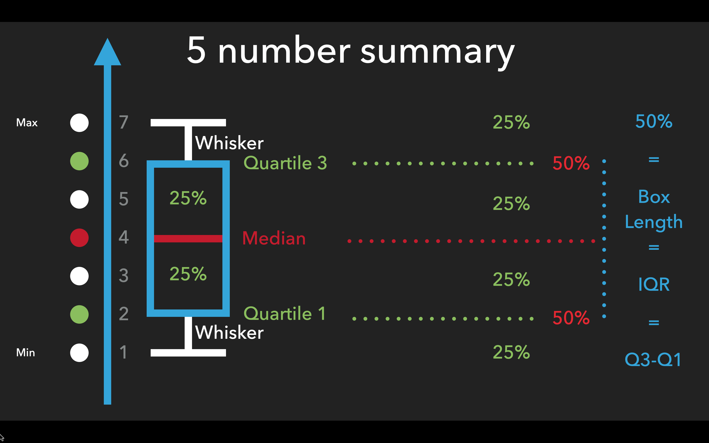
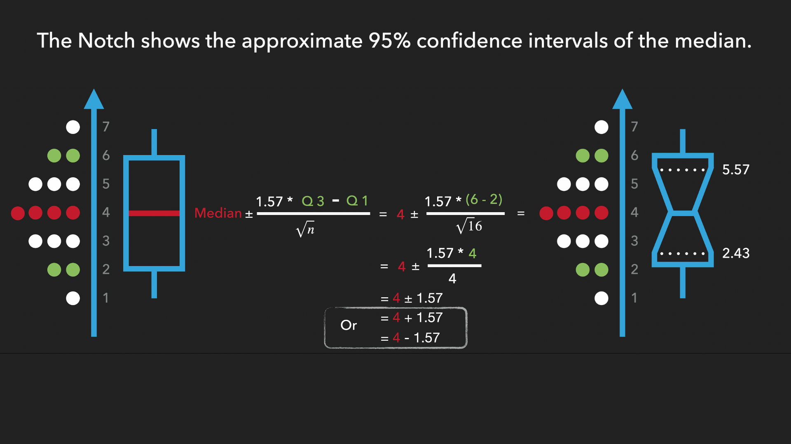

```{r setup, include=FALSE}
knitr::opts_chunk$set(echo = TRUE, warning=FALSE, message=FALSE)
```

# This post as ca. 17 minutes video

```{r, eval=T, echo=F}
vembedr::embed_youtube("rvm94zcoKT0") 
```


... for instance, the ...

# 1. Basic box plot provides a five-number summary of the data

To create a basic box plot, we’ll load necessary packages and obtain the “Wage” dataset from the ISLR package, which contains information about American salaries. We’ll then use the ggplot() function with two arguments: the data and the aesthetic mappings, where we put a numeric column we want to study. Finally, we’ll use the geom_boxplot() function to create a box plot, which IS the **five-number summary** for wages.

```{r}
library(tidyverse)      # for {ggplot2} & Co. packages
library(ISLR)           # for Wage dataset
theme_set(theme_test()) # for beautiful plot design

set.seed(777)           # for reproducibility 
d <- Wage %>% 
  sample_n(777) %>% 
  mutate(wage = round(wage))

ggplot(d, aes(wage))+
  geom_boxplot()
```


The five-number summary (from bottom to top) is represented by the:

- **minimum** wage, which is the end of the lowest whisker
- **first quartile (Q1)**, or the lowest horizontal line (hinge) of the box. It’s also called 25th percentile, because 25% of all the data is located between the minimum and the lowest line of the box
- **median** is the thick horizontal line in the middle of the box, which splits all the data in half and also the data in the box in half, so that both sub-boxes have 25% of the data even if they don’t look completely uneven. The median is sometimes called **second quartile (Q2)**, or 50th percentile
- **third quartile (Q3)** is the highest horizontal line (hinge) of the box. It’s also called a 75th percentile, because 75% of all the data is located between the minimum and the highest line of the box, and finally the
- **maximum** wage, as the end of the highest whisker


By the way, there is the whole Nature paper dedicated to visualizing box plots, so, if you are interested what really smart people have to say about it, have a look at their work: "Krzywinski, M., Altman, N. Visualizing samples with box plots. Nat Methods 11, 119–120 (2014). https://doi.org/10.1038/nmeth.2813".  Here I'll just use some of their fantastic plots: 


The **box** itself covers the middle 50% of the salaries. It goes from the 1st to the 3rd quartile, that's why we call it the interquartile range (IQR). The whiskers stretch the box to the lowest and highest values, but exclude outliers, giving us a really good idea of what we could generally earn. However, salaries of folks with different education levels, professions, etc. would differ, right? That leads us to the second benefit of box plots…

# 2. Box plots show how a variable changes across groups or categories

For example, to create side-by-side box plots that compare the distribution of wages across different education levels, we’ll put education levels on the x-axis and salaries on the y-axis.


```{r}
ggplot(d, aes(x = education, y = wage))+
  geom_boxplot()
```


This box plot shows us that higher education levels lead to higher salaries. Half of the people with the highest degree earn more than almost anyone with the lowest degree. So, education matters! Also, big boxes mean high variation of salaries (like in “4. College grad”), which offers more opportunities to earn money. Small boxes mean low variation (like in “1. < HS Grad”), implying less room for career growth. 

The people with the lowest degree are stuck with low pay. And the median of the lowest education level is very close to the lower hinge of the box. This means that, the distribution is skewed towards lower salaries. So that, the average salary in this group is misleading. It’s too high. And there are only two exceptions. Two people who earn as much as college graduates. They might be entrepreneurs. This leads us to the next benefit of box plots.

# 3. Boxplots emphasize outliers

But what is an outlier and why does it matter? In brief, outliers are data points significantly divergent from the rest, lying beyond 1.5 times the interquartile range (IQR) from the nearest box hinge (Q1 or Q3).


$$Lower \ whisker = Q1 - 1.5*IQR$$ 

$$Upper \ whisker = Q3 + 1.5*IQR$$


While outliers are often errors, they can also result from unusual events or provide new and interesting insights. Therefore, outliers do not always need to be removed. However, if a point falls outside 3 times the interquartile range (IQR), it can be deemed 'extreme' and should most likely be excluded from the dataset. In any case, both extreme points and outliers can skew our results, and should therefore be emphasized. Which can be easily done by specifying the color, size, and shape of outliers inside the geom_boxplot() function:

```{r}
ggplot(d, aes(x = education, y = wage))+
  geom_boxplot(outlier.color = "red",
               outlier.size  = 2,
               outlier.shape = 8)
```

## Make your plot interactive for reading it

The only problem with this box plot is that sometimes we want to know the exact values of ourliers or the 5-point summary. However, we have to guess it by staring at the y-axis. But there is a solution to it, namely, to make our plot interactive by:

- loading the {plotly} library
- wrapping our R-code into a ggplotly() command and
- pointing to the extreme earners in the high school grade, the Steve Jobses or Mark Zuckerbergs of the world, or finding out the median and quartiles, in order to confidently understand what 50% of people earn.

```{r}
library(plotly)
ggplotly(
  ggplot(d, aes(x = education, y = wage))+
  geom_boxplot(outlier.color = "red",
               outlier.size  = 2,
               outlier.shape = 8)
  )
```


# 4. Be more confident by adding notches - 95% CIs for medians

Speaking of confidence, while the median represents a more robust measure of central tendency compared to the mean, to enhance our confidence in the median, we can effortlessly add 95% confidence intervals to it. This is displayed as a notch around the median on the boxplot. To achieve this, we simply include the "notch = TRUE" argument inside the "geom_boxplot()" command:


```{r}
ggplot(d, aes(x = education, y = wage))+
  geom_boxplot(outlier.color = "red",
               outlier.size  = 2,
               outlier.shape = 8,
               notch = TRUE)
```

The Notch is important for two reasons. The first is - overlapping. Namely, if notches of neighboring boxplots overlap, there is a strong evidence, that samples don't differ. On the other hand, if the notches don't overlap, it indicates that the samples might differ significantly. However, only a real statistical test can confirm this, and we'll get to that at the end of the video.


The second reason the notch is important is that it gives us a hint about whether our sample size is too small or sufficiently big. Here's how we know: the notch is calculated as the median plus or minus 1.57 times the interquartile range (IQR) divided by the square root of our sample size:

$$Median \pm \frac{1.57*IQR}{\sqrt n}$$




So, if the notch stays inside the box, our sample size is sufficiently big, and we can trust our data, being confident in our median. But if the notch goes outside the box, we can not trust our data because our sample size is too small. 


By the way, a small sample size is the reason the notches in box plots are rarely shown in scientific studies. I am also guilty of that. So, if YOU display notches, your box plots will be much better than those of most scientific studies. And since sample size is so crucial, displaying it will make your box plot even more informative. And there are two ways to add sample size to every plot: implicitly and explicitly.

# 5. Add sample size


## Implicit 

The implicit way is similar to notches, where we do not show the real numbers. Using the "varwidth = TRUE" argument inside the "geom_boxplot()" function will adjust the width of every box, scaled by $\sqrt n$. The wider the box, the more data it contains.

```{r}
ggplot(d, aes(x = education, y = wage))+
  geom_boxplot(outlier.color = "red",
               outlier.size = 2,
               outlier.shape = 8,
               notch = TRUE,
               varwidth = TRUE)
```


## Explicit

However, it's always more useful to see the actual numbers. To achieve this, we'll first count the number of observations per education group and save it in a separate small data frame. Then, we'll use this data frame to display discrete labels on the x-axis below every boxplot, including:

- the name of the education group,
- a division fraction represented by "backslash n",
- the text "n = ", and finally,
- the actual numbers themselves;

... and if we look at the result, we'll confirm that the widest box corresponds to the highest number, while the narrowest box represents the lowest number.


```{r}
# count education groups first
counts <- d %>% 
  group_by(education) %>% 
  count()

counts

ggplot(d, aes(x = education, y = wage))+
  geom_boxplot(outlier.color = "red",
               outlier.size = 2,
               outlier.shape = 8,
               notch = TRUE,
               varwidth = T)+ # T = TRUE
  scale_x_discrete(
    labels = paste(counts$education, "\n n = ", counts$n) )
```

Here is an **IMPORTANT** detail: it is highly recommended to have **at least 5 observations** per group for the boxplot to be useful!

## Simplify coding

Now, as the code becomes more bulky, adding new features to the plot may become overwhelming. To streamline our programming journey, we can save the code we're satisfied with into a separate object at any point and use it for further modifications.

```{r}
p <- ggplot(d, aes(x = education, y = wage))+
  geom_boxplot(outlier.color = "red",
               outlier.size = 2,
               outlier.shape = 8,
               notch = TRUE,
               varwidth = T)+
  scale_x_discrete(
    labels = paste(counts$education, "\n n = ", counts$n) )

p
```


# 6. Display distribution via the violin plot

For example, we could use "p" to add the violin plot. Why violins? Well, violin plots might be even more informative than box plots because they show the distribution of data along both the horizontal and vertical axes, revealing its shape, symmetry, and spread.


This can be used to identify the most common wage values, the number of peaks, and to see whether the data is skewed or symmetric (or normally distributed. A violin plot is created by using a mathematical technique called kernel density estimation, which basically smooths out the data and makes it look like a violin.)

```{r}
p + 
  geom_violin()
```

If we overlay the violin on top of the box plot, they would overlap. However, we can make the violin transparent using the "alpha" argument, which ranges from 0 to 1. The closer alpha is to zero, the more transparent the violin becomes.

## Make violin transparent

```{r}
p1 <- p + 
  geom_violin(alpha = 0.01)

p1
```


# 7. Add fancy points without overlapping

```{r fig.width=11}
a <- p1 + 
  geom_point() 

b <- p1 + 
  geom_jitter() 

library(patchwork)
a + b
```

The usefulness of the violin plot lies in implicitly showing the data points. However, even though we don't necessarily need to see the data points, there are times when we still want to explicitly visualize them. "Now, listen to me very carefully: (says Terminator 800): avoid using  "geom_point" or "geom_jitter" to display points. Those commands are found in many tutorials and I have used them too. Until I found a better choice: "geom_sina()" from the {ggforce} package, where "sina" stands for Strength, Victory and Beauty! 😉


```{r}
p1 + 
  ggforce::geom_sina()
```

## Make points transparent & colored

Here we can see that the points now completely fill out the violin, which makes more sense compared to "geom_point" and "geom_jitter." However, they completely overshadow the box plot. Thus, similar to the violin, we can first make the points more transparent by applying the "alpha" argument, and then go one step further and paint them in different colors, to literally make our plot a bit more aesthetic 😁.

 
```{r fig.width=9}
library(ggforce)
p2 <- p1 + 
  geom_sina(alpha = 0.3, aes(color = education))

p2
```
Having all those beautiful points is amazing, however, one of the most important points is still missing - the average. But why do we need the average if we have the median in the center of the box? First of all, people understand the mean better than the median, and secondly, having both mean and median on the same plot will emphasize the skewness of data.

# 8. Add average point with 95% CIs for the average


Namely, when the mean and the median are close to each other, the data is most likely normally distributed, and we can use t-tests or ANOVA to compare groups. While when the mean lies far from the median, the data is skewed, and we would need to apply non-parametric methods, such as Mann-Whitney U or Kruskal-Wallis tests, to compare groups. 

To display the mean,

- we'll use the "stat_summary()" function,
- set the "fun.data" argument to "mean_cl_boot," and
- the "geom" argument to "point", and finally
- we'll color our average blue and increase its size to make it stand out on the plot.


```{r fig.width=9}
p2 +
  stat_summary(fun.data = mean_cl_boot, geom = "point",
               color = "blue", size = 3)
```

However, an average without confidence intervals is like a political statement—sounds very confident, but nobody is confident it will be done. So displaying confidence intervals (CIs) around the mean is as important as displaying the notches around medians. For that, we'll use the same command "stat_summary" with a new argument: geom = "errorbar". 

Adding the average with 95% confidence intervals makes any box plot even more informative and elegant. And it's not only my opinion. Namely, a scientific paper about "Visualizing samples with box plots" published in Nature says: 

"Box plots may be combined with sample mean and 95% CI error bars to communicate more information about samples in roughly the same amount of space." [^3]


[^3]: Krzywinski, M., Altman, N. Visualizing samples with box plots. Nat Methods 11, 119–120 (2014). https://doi.org/10.1038/nmeth.2813 https://www.nature.com/articles/nmeth.2813.pdf?proof=true


```{r fig.width=9}
p3 <- p2 +
  stat_summary(fun.data = mean_cl_boot, geom = "point",
               color = "blue", size = 3)+
  stat_summary(fun.data = mean_cl_boot, geom = "errorbar",
               color = "blue", size = 1, width = 0.4)

p3
```


What information is it, you might wonder? Well, let's check this out by making this plot interactive with "ggplotly". According to the highest education degree, we should earn $143,000 on average. But since:

- the median with $133,000 is far below the average and not even inside the confidence bands of the average, and
- since the widest part of the violin, which shows what the majority of people earn, is also far below the mean at $119,000,

... reporting the average salary of $143,000 on skewed data will overpromise and disappoint. That's why I personally get a bit skeptical when any source reports averages instead of medians. But I'd be interested to know what you think, so feel free to let me know in the comments section below.


```{r fig.width=11}
ggplotly(p3)
```

# Pimp your plot


## Change plot design with themes

Now, if this plot is not looking nice enough to you yet, you can quickly improve it's appearance, by choosing a new plot-design with a single command. Here are some useful themes for your convenience:

- theme_bw()
- theme_classic()
- theme_minimal()
- theme_test() - which we already used before the whole time.

```{r fig.width=9}
p4 <- p3 +
  theme_bw()

p4
```


## Control titles, captions, axis

Then, you can specify titles, captions, axis names within the "labs" command:


```{r fig.width=9}
p5 <- p4 +
  labs(
    title    = "Salary and education",
    subtitle = "should you invest in yourself?",
    caption  = "Source: ISLR package",
    x = "Education levels",
    y = "Salary in US$"
  )

p5
```


## Control legend, fonts, sizes

And finally, you can move or remove the legend, adjust color, size, font, or even the location of text on the plot. For instance, we can choose the "Times New Roman" font on our plot to match the text font in our publication. It's just effective! But we are just scratching the surface because the next thing you'll learn will absolutely blow your mind. But before we loose this beautiful plot, I want to show you how to save it.


```{r}
p6 <- p5 +
  theme(legend.position = "none",
        plot.title = element_text(
          color = "#0099f8", size = 16, face = "bold", hjust = 0.5),
        plot.subtitle = element_text(face = "bold.italic", hjust = 0.5),
        plot.caption = element_text(face = "italic"),
        axis.title.x = element_text(color = "blue", size = 14, 
                                face = "bold"),
    axis.title.y = element_text(size  = 14, face="italic"),
    text = element_text(family = "Times New Roman"))

p6
```

# Save your fancy picture

Once you're satisfied with your visualization, you can save it using the "ggsave" command in your preferred format, quality, and size. And if you are satisfied with this video (or article) so far, consider hitting the like 👍 button. 


```{r}
ggsave(
  "magic_boxplot.jpeg", 
  # "pdf", "jpeg", "tiff", "png", "bmp", 
  # "svg", "eps", "ps", "tex" or "wmf"
  device= jpeg,
  plot  = p6,
  width = 10,
  height= 7, 
  dpi   = 1000)
```


# 9. Add more variables to produce subplots quick

Now, while visualizing education levels is already very insightful, we can go one step further and add two more variables to our plot. 'Yes, we can,' as Obama would say. By employing the 'facet_grid' or 'facet_wrap' functions with two additional categorical variables, we can generate distinct subplots, each representing different combinations of these categorical variables.

```{r fig.width=11, fig.height=7, warning=TRUE}
p6 +
  facet_grid(jobclass ~ health_ins)
```

## Correct the mistakes

These additions provide even more useful information but also introduce some problems.

- First, R warns us that "Notches went outside hinges", primarily due to a small sample size causing larger confidence intervals than the box itself. It's advisable not to rely heavily on these 95% CIs for the median in such situations and avoid notches unless they fall entirely within the IQR. Although we initially followed this advice, splitting our plot into four subplots resulted in incorrect sample sizes on the x-axis. Thus, we need to either replace or remove them. For instance, let's eliminate the entire 'scale_x_discrete' command along with all the labels.

- Next, we'll incorporate more data by using the entire "Wage" dataset instead of the small portion we selected initially.

- Since too many points could be too dark, we'll increase the transparency of points by setting the "alpha" parameter closer to zero.

- And just for fun, we can add a horizontal green line to indicate the total average salary across the whole dataset, allowing us to observe how people's earnings compare to the average. 

```{r fig.width=11, fig.height=7}
ggplot(Wage, aes(x = education, y = wage))+
  geom_boxplot(outlier.color = "red",
               outlier.size  = 2,
               outlier.shape = 8,
               notch         = TRUE,
               varwidth      = T)+
  geom_violin(alpha = 0.1)+
  geom_sina(alpha   = 0.15,  aes(color = education))+
  stat_summary(fun.data = mean_cl_boot, geom = "point",
               color = "blue", size = 3)+
  stat_summary(fun.data = mean_cl_boot, geom = "errorbar",
               color = "blue", size = 1, width = 0.4)+
  labs(
    title    = "Salary and education",
    subtitle = "should you invest in yourself?",
    caption  = "Source: ISLR package",
    x = "Education levels",
    y = "Salary in US$"
  )+
  theme_bw()+
  theme(legend.position = "none",
        text=element_text(family="Times New Roman"),
        plot.title = element_text(color = "#0099f8", size = 16, face = "bold", hjust = 0.5),
        plot.subtitle = element_text(face = "bold.italic", hjust = 0.5),
        plot.caption = element_text(face = "italic"))+
  facet_grid(jobclass ~ health_ins) +
  # set some threshold
  geom_hline(yintercept = mean(Wage$wage, na.rm = T) , linetype = "dashed", color = "green", size = 1)
```


# 10. What’s next? Display significance tests!

So, notched box-violin plots are great for visualizing and comparing the distributions of different groups, but how can we test whether the differences are statistically significant? What if I told you that you can do that with **just four words of code?** Yes, you heard me right. With **only four words**, you can perform both frequentist and Bayesian ANOVAs on your data, and even show pairwise post-hoc tests on the same plot. And if you want to learn how to do it and how to interpret every number on this plot, check out my video on [ANOVA](https://youtu.be/JDGtLG0Tceo) (with `ggstatplot` by Indrajeet Patil [^4]).

[^4]: Patil I (2018). _ggstatsplot: 'ggplot2' Based Plots with Statistical
Details_. doi: 10.5281/zenodo.2074621 (URL:
https://doi.org/10.5281/zenodo.2074621), <URL:
https://CRAN.R-project.org/package=ggstatsplot>.

```{r echo=FALSE, fig.height=7}
library(ggstatsplot)
ggbetweenstats(d, education, wage)
```

# Less important things

## Display groups side by side

```{r}
ggplot(d, aes(x = education, y = wage, fill = jobclass))+
  geom_boxplot(outlier.color = "red",
               outlier.size  = 2,
               outlier.shape = 8,
               notch = TRUE,
               position = position_dodge(width = 0.9))+
  geom_violin(position = position_dodge(width = 0.9), alpha = 0.1)
```


---

If you think, I missed something, please comment on it, and I’ll improve this tutorial.

**Thank you for learning!**

